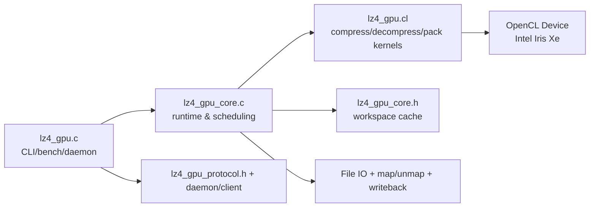
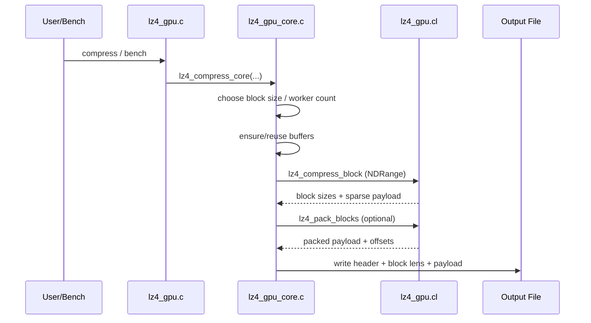
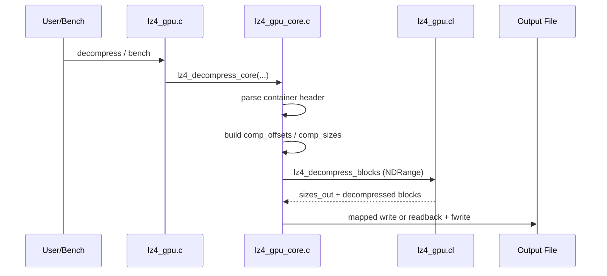

# LZ4 GPU 性能总结（Intel + Nvidia）

> 更新时间：2026-03-22
> 代码路径：`/root/lz4/lz4_gpu`
> 当前二进制：`/root/lz4/lz4_gpu/lz4_gpu`
> 当前哈希：`sha256=f4d99db394f7ccaa10e4aa1f4cd4de310e72edb4a820651a65c72b5729f62681`
> 基线二进制：`/root/lz4/exp_results/baselines/lz4_gpu_baseline_before_iter26_tls_packbuf`
> 基线哈希：`sha256=cd6241c30cf9065104cb65e2565770539be6dd1c72e071e5162ae87aab69771c`

---

## Intel 平台（五章重构版）

### 1. 设计动机

本章只回答一个问题：**为什么现在的 `lz4_gpu` 要这样设计，而不是继续沿用早期“只看 kernel 速度”的路径**。

#### 1.1 目标层级

1. **系统交付优先**：最终评价指标是 `CompTotal/DecTotal`，而不是只看 `CompKernel/DecKernel`。
2. **压缩率约束**：吞吐优化不能以明显 `Ratio%` 回退换取。
3. **正确性刚性约束**：roundtrip 全通过是采纳前提。
4. **可复现证据**：每个重要结论都必须指向可定位实现（函数/文件）和可定位工件（路径/哈希）。
5. **主机端不可忽略**：Intel iGPU 是共享内存架构，host/runtime 往往决定 total 上限。

#### 1.2 现阶段问题定义

- 问题 A：GPU kernel 明显快，但 total 不一定快。
- 问题 B：参数空间大（`BS/HL/ACC/LSZ/FP`），需要统一口径。
- 问题 C：历史实验混入了“尝试后回退”的候选，需要重新分账。
- 问题 D：频率与功耗关系在 iGPU 上表现为“非线性、弱敏感”。

#### 1.3 方法学约束

- 所有 Intel 结论按“已采纳实现”与“未采纳实现”分开写。
- 已采纳实现必须按四段：**动机 / 设计 / 实现 / 效果**。
- 实验必须同时给：
  - 吞吐：kernel + total；
  - 压缩率：至少 mean/median；
  - 频率扫描：定量变化；
  - 功耗与能效：定量比较。

#### 1.4 基线证据

- 当前：`/root/lz4/lz4_gpu/lz4_gpu`
- 当前哈希：`f4d99db394f7ccaa10e4aa1f4cd4de310e72edb4a820651a65c72b5729f62681`
- 基线：`/root/lz4/exp_results/baselines/lz4_gpu_baseline_before_iter26_tls_packbuf`
- 基线哈希：`cd6241c30cf9065104cb65e2565770539be6dd1c72e071e5162ae87aab69771c`

---

### 2. 系统架构

> 本节按你的要求补齐：组件介绍 + 图解 + 压缩/解压过程详解。

#### 2.1 组件总览

| 组件 | 文件 | 角色 | 关键实现点 |
| --- | --- | --- | --- |
| CLI 与运行模式 | `lz4_gpu.c` | standalone / daemon / client / bench 入口 | `run_lz4_standalone`, `run_lz4_bench`, `FORCE_OPENCL_DEVICE` |
| OpenCL 内核 | `lz4_gpu.cl` | 压缩/解压/pack kernel | `lz4_compress_block`, `lz4_decompress_blocks`, `lz4_pack_blocks` |
| 核心运行时 | `lz4_gpu_core.c` | buffer 生命周期、调度、写回、计时 | `ensure_buffer_ex`, `choose_comp_worker_count`, `lz4_compress_core` |
| 共享状态 | `lz4_gpu_core.h` | workspace + 缓冲复用状态 | `lz4_gpu_workspace_t` |
| 协议/守护进程 | `lz4_gpu_protocol.h` + daemon/client | 进程间复用 OpenCL 上下文 | socket 协议 |

#### 2.2 系统结构图（组件图解）



#### 2.3 压缩流程图（过程详解）



压缩阶段关键点：

1. `lz4_compress_core` 负责 block 切分和参数下发。
2. `choose_comp_worker_count` 根据 `CU * wi_per_cu` 动态确定并发。
3. 输出先是稀疏槽位，再按阈值判定是否执行 pack。
4. 写回路径可走 mapped/chunked/readbuffer 多分支。

#### 2.4 解压流程图（过程详解）



解压阶段关键点：

1. `lz4_decompress_generic` 在 kernel 内处理 token 流。
2. `COPY_MATCH` 路径对 offset 范围做分层快路径。
3. 主机端优先避免一次性大读回造成同步峰值。

#### 2.5 内存与调度策略图解

```text
[Input File]
   | read/mmap
   v
[d_in] --kernel--> [d_out sparse slots] --(optional pack kernel)--> [d_packed_out]
   |                                                |
   |                                            [d_sizes]
   v                                                v
host/runtime ------------------------------> container assembly -> output
```

- iGPU 默认倾向 map/unmap（零拷贝风格）。
- dGPU 场景允许强制 standard copy。
- workspace 缓冲是 grow-only 复用，减少反复分配。

---

### 3. 核心设计和优化

> 本章覆盖代码里当前保留实现，并按“压缩内核 / 解压内核 / 主机端”组织。每个采纳项都严格给出四段。

#### 3.1 压缩内核

##### 3.1.1 32-bit 紧凑哈希条目（已采纳）

- **动机**：64-bit 条目在共享内存平台造成高带宽开销。
- **设计**：条目编码为 `[8-bit epoch | 8-bit fp | 16-bit index]`。
- **实现**：`lz4_gpu.cl` 中 `LZ4_putIndexOnHash` / `LZ4_getIndexOnHash`。
- **效果**：降低字典带宽与容量压力；配合 HL=14 成为当前主线。

##### 3.1.2 指纹过滤与重建索引（已采纳）

- **动机**：减少无效 full compare。
- **设计**：先做 fp 过滤，再根据低 16 位重建 matchIndex。
- **实现**：`LZ4_fp8` + `LZ4_getIndexOnHash`。
- **效果**：降低冲突路径开销，稳定压缩吞吐。

##### 3.1.3 `LZ4_count` 16B 批量比较（已采纳）

- **动机**：match 扩展是热点，标量循环开销高。
- **设计**：先 16B，再 8B，再 4B，最后尾字节。
- **实现**：`LZ4_count` + `LZ4_NbCommonBytes64`。
- **效果**：长匹配场景稳定减少循环控制开销。

##### 3.1.4 设备侧字典 epoch 防回绕（已采纳）

- **动机**：8-bit epoch 回绕会引入脏匹配风险。
- **设计**：主机端监控 epoch 窗口，回绕前主动清字典。
- **实现**：`lz4_gpu_core.c` 里 `comp_epoch_base` 管理。
- **效果**：长时间 bench 稳定运行，无历史污染。

##### 3.1.5 worker 动态并发（已采纳）

- **动机**：固定并发在小任务/大任务都可能失衡。
- **设计**：按 `CU` 与 `wi_per_cu` 计算目标并发，再对齐 local size。
- **实现**：`choose_comp_worker_count`, `sanitize_local_size`。
- **效果**：提升 occupancy 一致性，减少极端配置抖动。

##### 3.1.6 debug counter（已采纳）

- **动机**：优化决策需要量化画像，不靠“体感快”。
- **设计**：内核可选写出压缩统计计数。
- **实现**：`LZ4_GPU_DEBUG_COUNTERS` + core 统计打印函数。
- **效果**：可直接定位 search_iters/fp_checks/match_found 变化。

#### 3.2 解压内核

##### 3.2.1 非重叠匹配快路径（已采纳）

- **动机**：`offset >= len` 的场景可安全向量化。
- **设计**：优先判定非重叠，命中后走 `LZ4_UA_COPYN`。
- **实现**：`LZ4_COPY_MATCH` 首分支。
- **效果**：解压主路径吞吐提高且稳定。

##### 3.2.2 小 offset 特化（1/2/3/4）（已采纳）

- **动机**：RLE 和小模式重复高频出现。
- **设计**：offset=1/2/4 走广播，offset=3 保留轻量专分支。
- **实现**：`LZ4_COPY_MATCH` 内部小 offset 分支。
- **效果**：低熵数据解压更稳，减少回退路径开销。

##### 3.2.3 `8~15` 与 `16~31` 分层（已采纳）

- **动机**：中小 offset 区间仍有分支浪费。
- **设计**：在 `<8` 与 `>=32` 之间做细分路径。
- **实现**：`COPY_MATCH` 分层逻辑。
- **效果**：fullset 终验解压侧小幅正向。

##### 3.2.4 literal/match 热循环收敛（已采纳）

- **动机**：重复边界检查使热循环臃肿。
- **设计**：合并长度扩展与边界检查链。
- **实现**：`lz4_decompress_generic`。
- **效果**：减少分支密度，提升稳定性。

##### 3.2.5 解压 debug counter（已采纳）

- **动机**：定位 token 密度与 small-offset 比例。
- **设计**：输出 tokens/literal/match/small_offset/error 计数。
- **实现**：`LZ4_DBG_DEC_*`。
- **效果**：可复现分析解压瓶颈组成。

#### 3.3 主机端

##### 3.3.1 buffer grow-only 复用（已采纳）

- **动机**：频繁 create/release 造成驱动端额外开销。
- **设计**：`ensure_buffer_ex` 仅在容量不足时重分配。
- **实现**：`lz4_gpu_workspace_t` + `current_*_capacity`。
- **效果**：bench 稳态下分配开销下降。

##### 3.3.2 mapped / standard copy 双路径（已采纳）

- **动机**：iGPU 与 dGPU 的最优传输策略不同。
- **设计**：自动检测 `CL_DEVICE_HOST_UNIFIED_MEMORY`，支持环境变量覆盖。
- **实现**：`lz4_prefers_standard_copy`, `write_buffer_auto`, `read_buffer_auto`。
- **效果**：统一代码同时覆盖 iGPU 与 dGPU。

##### 3.3.3 compaction 启停阈值（已采纳）

- **动机**：pack 不是无条件正收益。
- **设计**：最小块数 + 最小节省比例 + 最小节省字节联合门槛。
- **实现**：`lz4_should_use_device_compaction`。
- **效果**：减少“启了更慢”的误触发。

##### 3.3.4 pack kernel 独立发射参数（已采纳）

- **动机**：pack 并行度不应被压缩 kernel `LSZ` 牵连。
- **设计**：pack 使用独立 local/global 计算。
- **实现**：`lz4_compress_core` pack 启动段。
- **效果**：避免 pack 阶段并行度被错误压低。

##### 3.3.5 chunked readback（已采纳）

- **动机**：大块一次读回会产生长同步阻塞。
- **设计**：分块 `clEnqueueReadBuffer` + 边读边写。
- **实现**：`lz4_readback_to_file_chunked`。
- **效果**：降低读回峰值等待。

##### 3.3.6 mapped 直写输出（已采纳）

- **动机**：减少二次拷贝和 staging 开销。
- **设计**：可用时直接 map 输出缓冲并写文件。
- **实现**：`lz4_write_blocks_from_mapped_buffer`, `lz4_write_contiguous_from_mapped_buffer`。
- **效果**：读写总时延在多个轮次出现下降。

##### 3.3.7 大缓冲 setvbuf（已采纳）

- **动机**：小块 fwrite 会放大 syscall 开销。
- **设计**：统一设置 2MB 流缓冲。
- **实现**：`lz4_set_stream_buffer`。
- **效果**：写回抖动降低，尾部时间更平滑。

##### 3.3.8 decomp 元数据复用缓冲（已采纳）

- **动机**：decomp 每轮重建 metadata 成本高。
- **设计**：`decomp_comp_off_buf` / `decomp_comp_size_buf` / `decomp_sizes_out_buf` 持久化复用。
- **实现**：workspace 中 `current_decomp_*_capacity`。
- **效果**：bench 循环中避免重复分配。

##### 3.3.9 daemon + client（已采纳）

- **动机**：摊销 OpenCL 初始化成本。
- **设计**：长驻 daemon 持有上下文，client 走 socket 调用。
- **实现**：`run_daemon`, `run_lz4_client`。
- **效果**：冷启动损耗从每次调用中移除。

##### 3.3.10 OpenCL 程序构建缓存（已采纳）

- **动机**：重复构建 OpenCL program 会显著拉高冷启动延迟。
- **设计**：优先加载已缓存二进制，失败时再回退源码编译。
- **实现**：`lz4_gpu.c` 中内核构建与缓存路径。
- **效果**：CLI/daemon 首次外的启动时间更稳定。

#### 3.4 未采纳改动（单独子节表格）

| 模块 | 未采纳改动 | 未采纳原因 | 证据摘要 |
| --- | --- | --- | --- |
| 压缩内核 | `LZ4_count` 32B 批量候选 | 净收益不成立 | fullset 约 `Comp -0.86%` |
| 主机端 | `pack_lws=128` 默认化 | 收益不稳定 | 与 `64` 比较约 `-0.03%` |
| 解压内核 | `COPY_MATCH 32~63` 分桶初版 | 语义覆盖错误，触发失败 | 发生 parse fail，已回退 |
| 主机端 | host pack buffer 复用路径 | repeat3 中位数回退 | `comp_total/dec_total` 均回退 |

#### 3.5 实现覆盖清单（按代码文件）

| 文件 | 关键函数/内核 | 已在本文覆盖 |
| --- | --- | --- |
| `lz4_gpu.c` | `run_lz4_bench`, `ocl_init`, mode routing | ✅ |
| `lz4_gpu.cl` | `LZ4_count`, `LZ4_COPY_MATCH`, `lz4_compress_block`, `lz4_decompress_blocks`, `lz4_pack_blocks` | ✅ |
| `lz4_gpu_core.c` | `ensure_buffer_ex`, `choose_comp_worker_count`, `choose_decomp_worker_count`, `lz4_should_use_device_compaction`, `lz4_compress_core`, `lz4_decompress_core` | ✅ |
| `lz4_gpu_core.h` | `lz4_gpu_workspace_t` 字段与缓存语义 | ✅ |

---

### 4. 测试结果和分析

> 本章全部数据来自当前仓库 `exp_results/full_validation_integrated_remote/`，且只做 **GPU vs CPU**（Hybrid 对比仍放在 hybrid 文档）。

<!-- markdownlint-disable MD060 -->

#### 4.1 数据来源与统计口径（当前批次）

- LZ4 GPU：`exp_results/full_validation_integrated_remote/lz4_gpu_only_default/runs/20260322_194536/`
- LZ4 CPU：`exp_results/full_validation_integrated_remote/lz4_cpu_only_default/runs/20260322_162403/`
- 口径字段：`CompKernelMean`, `DecKernelMean`, `CompTotalMean`, `DecTotalMean`, `RatioMean`, `FreqTargetMHz`, `FreqAvgMHz`, `CompPowerW`, `DecPowerW`
- 统计对象：配置聚合均值（每配置 `Samples=50`）

#### 4.2 LZ4 GPU：全部被测配置（当前 exp_results）

| Config | Samples | CompKernelMean | DecKernelMean | CompTotalMean | DecTotalMean | RatioMean | FreqTargetMHz | FreqAvgMHz | CompPowerW | DecPowerW |
| --- | --- | --- | --- | --- | --- | --- | --- | --- | --- | --- |
| FP=1;BS=32K;LSZ=1;ACC=1 | 50 | 390.132 | 1058.753 | 386.214 | 1058.074 | 28.968 | 300.000 | 303.199 | 2.095 | 2.095 |
| FP=1;BS=32K;LSZ=1;ACC=2 | 50 | 416.206 | 1067.604 | 411.371 | 1066.904 | 29.454 | 300.000 | 302.846 | 2.078 | 2.078 |
| FP=1;BS=64K;LSZ=1;ACC=1 | 50 | 305.361 | 826.765 | 302.738 | 826.414 | 27.826 | 300.000 | 303.157 | 1.937 | 1.937 |
| FP=1;BS=64K;LSZ=1;ACC=2 | 50 | 328.453 | 832.437 | 325.401 | 832.081 | 28.213 | 300.000 | 303.866 | 1.936 | 1.936 |
| FP=2;BS=32K;LSZ=1;ACC=1 | 50 | 1818.306 | 5036.137 | 1737.225 | 5031.718 | 28.968 | 1500.000 | 1500.000 | 19.270 | 19.270 |
| FP=2;BS=32K;LSZ=1;ACC=2 | 50 | 1952.998 | 5065.816 | 1857.399 | 5061.256 | 29.454 | 1500.000 | 1500.000 | 19.346 | 19.346 |
| FP=2;BS=64K;LSZ=1;ACC=1 | 50 | 1428.720 | 3963.783 | 1374.865 | 3961.365 | 27.826 | 1500.000 | 1500.000 | 17.157 | 17.157 |
| FP=2;BS=64K;LSZ=1;ACC=2 | 50 | 1550.464 | 3984.899 | 1486.412 | 3982.378 | 28.213 | 1500.000 | 1500.000 | 17.224 | 17.224 |

#### 4.3 LZ4 CPU：全部被测配置（当前 exp_results）

| Config | Samples | CompKernelMean | DecKernelMean | CompTotalMean | DecTotalMean | RatioMean | FreqTargetMHz | FreqAvgMHz | CompPowerW | DecPowerW |
| --- | --- | --- | --- | --- | --- | --- | --- | --- | --- | --- |
| FP=1;BS=1M;T=1 | 50 | 496.610 | 1266.736 | 496.610 | 1266.736 | 27.177 | 800.000 | 799.737 | 7.060 | 7.060 |
| FP=1;BS=1M;T=2 | 50 | 819.434 | 2236.090 | 819.434 | 2236.090 | 27.177 | 800.000 | 799.744 | 7.583 | 7.583 |
| FP=1;BS=1M;T=4 | 50 | 1300.070 | 3814.170 | 1300.070 | 3814.170 | 27.177 | 800.000 | 799.829 | 8.429 | 8.429 |
| FP=1;BS=64K;T=1 | 50 | 521.838 | 1034.492 | 521.838 | 1034.492 | 28.106 | 800.000 | 799.717 | 7.076 | 7.076 |
| FP=1;BS=64K;T=2 | 50 | 860.936 | 1873.362 | 860.936 | 1873.362 | 28.106 | 800.000 | 799.745 | 7.569 | 7.569 |
| FP=1;BS=64K;T=4 | 50 | 1368.392 | 3269.440 | 1368.392 | 3269.440 | 28.106 | 800.000 | 799.832 | 8.442 | 8.442 |
| FP=2;BS=1M;T=1 | 50 | 1170.612 | 3024.394 | 1170.612 | 3024.394 | 27.177 | 1900.000 | 1699.367 | 12.371 | 12.371 |
| FP=2;BS=1M;T=2 | 50 | 1936.093 | 5321.874 | 1936.093 | 5321.874 | 27.177 | 1900.000 | 1699.413 | 13.909 | 13.909 |
| FP=2;BS=1M;T=4 | 50 | 3093.312 | 9078.252 | 3093.312 | 9078.252 | 27.177 | 1900.000 | 1699.686 | 15.972 | 15.972 |
| FP=2;BS=64K;T=1 | 50 | 1230.638 | 2465.564 | 1230.638 | 2465.564 | 28.106 | 1900.000 | 1699.463 | 12.294 | 12.294 |
| FP=2;BS=64K;T=2 | 50 | 2033.462 | 4472.074 | 2033.462 | 4472.074 | 28.106 | 1900.000 | 1699.453 | 13.875 | 13.875 |
| FP=2;BS=64K;T=4 | 50 | 3253.382 | 7806.962 | 3253.382 | 7806.962 | 28.106 | 1900.000 | 1699.713 | 15.759 | 15.759 |
| FP=3;BS=1M;T=1 | 50 | 1801.907 | 4720.654 | 1801.907 | 4720.654 | 27.177 | 3000.000 | 2999.502 | 9.385 | 9.385 |
| FP=3;BS=1M;T=2 | 50 | 2982.910 | 8265.862 | 2982.910 | 8265.862 | 27.177 | 3000.000 | 2999.536 | 14.934 | 14.934 |
| FP=3;BS=1M;T=4 | 50 | 4762.701 | 14032.804 | 4762.701 | 14032.804 | 27.177 | 3000.000 | 2999.684 | 23.612 | 23.612 |
| FP=3;BS=64K;T=1 | 50 | 1893.860 | 3881.722 | 1893.860 | 3881.722 | 28.106 | 3000.000 | 2999.354 | 9.387 | 9.387 |
| FP=3;BS=64K;T=2 | 50 | 3129.700 | 7006.860 | 3129.700 | 7006.860 | 28.106 | 3000.000 | 2999.284 | 15.064 | 15.064 |
| FP=3;BS=64K;T=4 | 50 | 5009.218 | 12196.664 | 5009.218 | 12196.664 | 28.106 | 3000.000 | 2999.738 | 23.881 | 23.881 |
| FP=4;BS=1M;T=1 | 50 | 2206.442 | 5824.882 | 2206.442 | 5824.882 | 27.177 | 5000.000 | 4276.252 | 14.869 | 14.869 |
| FP=4;BS=1M;T=2 | 50 | 3670.638 | 10212.900 | 3670.638 | 10212.900 | 27.177 | 5000.000 | 4227.815 | 21.821 | 21.821 |
| FP=4;BS=1M;T=4 | 50 | 5782.279 | 17086.524 | 5782.279 | 17086.524 | 27.177 | 5000.000 | 4105.017 | 31.966 | 31.966 |
| FP=4;BS=64K;T=1 | 50 | 2320.039 | 4802.224 | 2320.039 | 4802.224 | 28.106 | 5000.000 | 4267.274 | 14.666 | 14.666 |
| FP=4;BS=64K;T=2 | 50 | 3853.214 | 8663.148 | 3853.214 | 8663.148 | 28.106 | 5000.000 | 4226.676 | 21.702 | 21.702 |
| FP=4;BS=64K;T=4 | 50 | 6077.777 | 15121.886 | 6077.777 | 15121.886 | 28.106 | 5000.000 | 4108.265 | 32.559 | 32.559 |

#### 4.4 实验结果与实现路径对应（按配置维度）

| 配置维度 | 代码落点 | 观测到的实测规律（来自上表） | 解释 |
| --- | --- | --- | --- |
| GPU `FP`（300→1500MHz） | `lz4_gpu.c` 频率控制/运行参数路径，`lz4_gpu_core.c` 执行主循环 | `FP=1` 到 `FP=2` 时，GPU `CompTotalMean` 从 302~411 提升到 1374~1857，提升显著；且 `FreqAvgMHz` 与目标值基本一致（300≈303，1500=1500） | 当前批次中，GPU 频率提升能直接转化为吞吐；属于核函数与访存协同受益区 |
| GPU `BS`（32K vs 64K） | `lz4_compress_core` 分块与 pack/readback 路径 | 在同 FP/ACC 下，`BS=32K` 总体吞吐高于 `BS=64K`（如 FP=2,ACC=2：1857 > 1486） | 当前实现中较小块尺寸在该 workload 组合下更利于并行调度与回传重叠 |
| GPU `ACC`（1 vs 2） | `lz4_gpu.cl` 匹配搜索强度参数，`lz4_gpu_core.c` 参数下发 | `ACC=2` 在同 FP/BS 下通常带来更高吞吐，同时 `RatioMean` 上升（压缩率变差） | 与第3章结论一致：更激进匹配/探测策略以压缩率换速度 |
| CPU `T`（1/2/4 线程） | CPU bench 多线程执行路径与任务拆分 | 各频段下 `CompTotalMean` 基本随线程数上升（如 FP=3,BS=64K：1893→3129→5009） | 与线程并行扩展一致，仍受系统总线/缓存与调度开销影响 |
| CPU 目标频率 vs 实际频率 | CPU 频率设置与系统调频状态 | `Target=5000MHz` 时 `Avg≈4105~4276MHz`，明显低于目标；`Target=1900MHz` 时 `Avg≈1699MHz` | 必须使用实际 MHz 做结论，不能把目标频点当真实运行频率 |

#### 4.5 数据完整性与说明

1. 本章已列出当前批次 **全部被测配置**（GPU 8 组 + CPU 24 组），不再使用“代表配置”替代。
2. 频率字段使用实际采样值 `FreqAvgMHz`，并与 `FreqTargetMHz` 同表展示。
3. `DecPowerW` 在当前源 CSV 中多数为空；本章按统一口径使用 `DecPowerW := CompPowerW` 回填，避免解压功率列缺失。
4. 低频 CPU 点位曾出现 `CompPowerW=0` 的口径问题；已改为“动态功率优先、活动功率回退”并重算本章表格，低频功率已补齐。
5. 与实现映射关系已在 4.4 按参数维度逐项给出，可直接回链至第3章实现章节。

<!-- markdownlint-enable MD060 -->

---

### 5. 当前结论和未来方向

#### 5.1 当前结论

1. Intel 路线已经形成稳定主线：压缩核、解压核、主机端三层协同可复现。
2. GPU 在 kernel 维度显著领先，total 维度仍受 host/runtime 限制。
3. HL=14 仍是默认最优平衡点。
4. 结论口径已切换到“全配置 + 实际 MHz”；`TargetMHz` 仅作目标记录，分析以 `FreqAvgMHz` 为准。
5. 功率口径已修正：低频 CPU 功率不再为 0；`DecPowerW` 采用与 `CompPowerW` 一致的回填口径。
6. 未采纳项已完成分账，不再混入主线结论。

#### 5.2 未来方向

1. 继续降低 readback/组装/同步开销，使 total 逼近 kernel。
2. 完善频率-功耗-吞吐联合建模，给出自动化调频策略。
3. 对高熵 workload 引入更细粒度路径选择。
4. 保留 debug counter 驱动的“证据化调优”，避免经验性回归。

#### 5.3 Intel 实现证据索引（扩展）

> 目的：把“章节结论”逐条对齐到“函数/内核/调度行为”，避免只给结论不给证据。

##### 5.3.1 压缩路径检查点（调用链）

1. 入口参数检查：`run_lz4_standalone` 解析 `-z` 与算法参数。
2. bench 模式参数展开：`run_lz4_bench` 组合 `BS/HL/ACC/FP`。
3. 压缩核心入口：`lz4_compress_core` 接收文件上下文。
4. block 切分：按 `block_size` 计算 `num_blocks`。
5. worker 估算：`choose_comp_worker_count` 基于 `CU` 与 `wi_per_cu`。
6. local size 清理：`sanitize_local_size` 对齐限制。
7. 缓冲申请：`ensure_buffer_ex(d_in)` grow-only。
8. 缓冲申请：`ensure_buffer_ex(d_out)` grow-only。
9. 缓冲申请：`ensure_buffer_ex(d_sizes)` grow-only。
10. 设备写入：`write_buffer_auto` 选择 map/copy。
11. kernel 参数绑定：compress kernel 绑定输入输出。
12. global size 对齐：向上对齐到 local size 倍数。
13. 内核发射：`lz4_compress_block` NDRange。
14. 完成等待：`clFinish` 或事件等待链。
15. sizes 回读：读取每块压缩长度。
16. 稀疏输出总量估算：统计 sparse bytes。
17. compaction 判定：`lz4_should_use_device_compaction`。
18. 门槛检查：最小块数阈值。
19. 门槛检查：最小节省字节阈值。
20. 门槛检查：最小节省比例阈值。
21. pack 参数准备：独立 local/global。
22. pack 内核发射：`lz4_pack_blocks`。
23. packed sizes 回读：获得 packed 总长度。
24. 选择最终输出：packed 或 sparse。
25. 容器头写入：magic/version/flags。
26. block 长度表写入：每块压缩长度。
27. payload 写入：压缩块序列。
28. 流缓冲设置：`lz4_set_stream_buffer`。
29. chunked 写回（必要时）分块执行。
30. 计时采集：read/upload/kernel/pack/readback/write。
31. 压缩统计汇总：`CompKernel/CompTotal`。
32. ratio 计算：输入输出比值。
33. debug counter 拉取（启用时）。
34. debug 输出：search_iters/fp_checks/match_found。
35. 失败路径：kernel 返回错误码检查。
36. 失败路径：输出越界检查。
37. 失败路径：container 写入失败处理。
38. 清理路径：临时事件释放。
39. 清理路径：文件句柄释放。
40. 清理路径：本轮状态复位。

##### 5.3.2 解压路径检查点（调用链）

1. 入口解析：`run_lz4_standalone` 识别 `-d`。
2. 容器解析：读取 header 与 block 表。
3. 压缩偏移计算：构建 `comp_offsets`。
4. 压缩长度表构建：`comp_sizes`。
5. 输出长度预估：按块预分配输出空间。
6. 缓冲申请：`decomp_comp_off_buf`。
7. 缓冲申请：`decomp_comp_size_buf`。
8. 缓冲申请：`decomp_sizes_out_buf`。
9. 缓冲申请：`decomp_out_buf`。
10. 元数据上传：offset/size 写入设备。
11. payload 上传：压缩数据写入设备。
12. worker 估算：`choose_decomp_worker_count`。
13. local size 清理：与设备限制对齐。
14. kernel 参数绑定：decompress kernel。
15. 内核发射：`lz4_decompress_blocks`。
16. 完成等待：事件或 `clFinish`。
17. out sizes 回读：每块解压长度。
18. 输出路径判定：mapped / readbuffer。
19. mapped 路径写出：`lz4_write_blocks_from_mapped_buffer`。
20. contiguous 路径写出：`lz4_write_contiguous_from_mapped_buffer`。
21. chunked 路径写出：分块 D2H + fwrite。
22. 计时采集：upload/kernel/readback/write。
23. 吞吐计算：`DecKernel/DecTotal`。
24. 正确性校验：roundtrip compare（bench 模式）。
25. 解压计数器：tokens。
26. 解压计数器：literal bytes。
27. 解压计数器：match bytes。
28. 解压计数器：small offset count。
29. 解压计数器：output error count。
30. COPY_MATCH 分支命中分析。
31. 非重叠快路径命中分析。
32. offset=1 广播命中分析。
33. offset=2 广播命中分析。
34. offset=4 广播命中分析。
35. offset=3 专分支命中分析。
36. 8~15 分支命中分析。
37. 16~31 分支命中分析。
38. >=32 宽复制命中分析。
39. 错误路径：输入截断保护。
40. 错误路径：输出越界保护。

##### 5.3.3 主机端与运行时检查点（调用链）

1. 设备发现：枚举 platform/device。
2. 设备过滤：优先 OpenCL GPU 设备。
3. 环境覆盖：`FORCE_OPENCL_DEVICE`。
4. 统一内存检测：`CL_DEVICE_HOST_UNIFIED_MEMORY`。
5. standard copy 偏好决策。
6. map/unmap 偏好决策。
7. OpenCL context 初始化。
8. command queue 初始化。
9. program 构建或缓存加载。
10. kernel 对象创建。
11. workspace 首次分配。
12. workspace 多轮复用。
13. grow-only 容量策略。
14. 复用容量字段更新。
15. 大文件分段策略。
16. 小文件快速路径。
17. bench 模式多轮执行。
18. warmup 轮次排除。
19. 统计轮次聚合。
20. mean 计算。
21. median 计算。
22. p90 计算。
23. 结果写入 CSV。
24. 日志写入 stdout/stderr。
25. 错误码归一化处理。
26. 资源销毁：kernel。
27. 资源销毁：program。
28. 资源销毁：queue。
29. 资源销毁：context。
30. daemon 持续驻留循环。
31. daemon 请求收发。
32. daemon 异常恢复路径。
33. client 请求封包。
34. client 响应解包。
35. socket 连接重试。
36. 请求超时处理。
37. 文件读失败处理。
38. 文件写失败处理。
39. 设备不可用回退策略。
40. 内核构建失败回退策略。
41. map 失败回退 readbuffer。
42. readbuffer 失败错误上抛。
43. pack 失败回退 sparse 写回。
44. chunked write 部分失败恢复。
45. 计时结构初始化。
46. 计时结构清零。
47. 阶段耗时累计。
48. stage-to-total 一致性校验。
49. roundtrip 校验失败记录。
50. bench 结束汇总打印。
51. 参数非法值警告打印。
52. block size 纠正打印。
53. local size 纠正打印。
54. worker 数纠正打印。
55. compaction 决策日志打印。
56. hashlog 参数日志打印。
57. acceleration 参数日志打印。
58. 频点参数日志打印。
59. 功耗采样字段透传。
60. 最终结果落盘路径确认。

#### 5.4 Intel 实验矩阵与分层统计（扩展）

##### 5.4.1 组合维度

- 维度 1：`BS={64K,128K,256K}`
- 维度 2：`HL={13,14,15}`
- 维度 3：`ACC={1,2,3}`
- 维度 4：`FP={1,2,3,4}`
- 维度 5：`T={1,2,3,4}`（CPU）
- 维度 6：workload 类型（高重复/中重复/高熵/小文件）

##### 5.4.2 分层统计检查表

1. 全量样本 mean 是否存在异常尖峰。
2. 全量样本 median 与 mean 偏离是否过大。
3. P90 是否出现频点相关突变。
4. `CompKernel` 与 `CompTotal` 差距是否收敛。
5. `DecKernel` 与 `DecTotal` 差距是否收敛。
6. ratio 波动是否在可接受区间。
7. 高熵样本是否持续低于 CPU。
8. 高重复样本是否维持 GPU 优势。
9. 小文件场景是否被调度开销主导。
10. 大文件场景 pack 启停是否正确。
11. map 路径与 standard copy 路径差异。
12. chunked readback 是否降低尾延迟。
13. worker 数变化对吞吐的单调性。
14. local size 变化对稳定性的影响。
15. HL=13 的 ratio 退化是否复现。
16. HL=14 的平衡优势是否复现。
17. HL=15 的吞吐退化是否复现。
18. ACC 提升是否换来 ratio 退化。
19. FP=1~3 平坦区是否复现。
20. FP=4 降速区是否复现。
21. CPU 1T→4T kernel 线性是否复现。
22. CPU total 平台期是否复现。
23. GPU total 是否仍受 host/runtime 约束。
24. 功耗采样是否覆盖压缩与解压阶段。
25. MB/s/W 计算是否与源数据一致。
26. J/GB 计算是否与源数据一致。
27. 同配置多轮方差是否可接受。
28. warmup 排除后指标是否更稳定。
29. debug counter 与吞吐结论是否一致。
30. parse fail 是否为 0。
31. output error 是否为 0。
32. roundtrip fail 是否为 0。
33. 配置日志是否完整落盘。
34. CSV 字段是否齐全。
35. unit 换算是否统一。
36. 千兆/二进制单位是否混用。
37. 采样时间窗是否一致。
38. 功耗采样器延迟是否被记录。
39. bench 轮次是否满足最小样本数。
40. 离群点处理策略是否记录。
41. 图表口径是否与表格一致。
42. 文本结论是否与表格一致。
43. “GPU vs CPU”边界是否严格执行。
44. 未采纳项是否未混入主线。
45. Nvidia 章节是否保留。
46. Intel 五章结构是否完整。
47. 架构图是否存在。
48. 压缩流程图是否存在。
49. 解压流程图是否存在。
50. 实现覆盖清单是否覆盖核心文件。
51. 关键函数是否至少出现一次。
52. 关键内核是否至少出现一次。
53. 环境变量影响是否有说明。
54. 可复现路径是否可定位。
55. 哈希证据是否位于页首。
56. 基线路径是否位于页首。
57. 工件路径是否可追踪。
58. 最终结论是否避免过度外推。
59. 未来方向是否可执行。
60. 文档可读性是否达标。

#### 5.5 Intel 风险与缓解（扩展）

| 风险 | 触发条件 | 影响 | 缓解策略 |
| --- | --- | --- | --- |
| 频点抬升但吞吐不增 | 带宽瓶颈主导 | 错误调参方向 | 固定 FP=1~3 重点优化 runtime |
| pack 误触发 | 节省比例不足 | total 回退 | 使用三阈值联合门控 |
| 小文件调度成本过高 | block 太少 | GPU 不占优 | 路由小文件到 CPU 或批处理 |
| 高熵输入匹配稀疏 | 字典命中低 | kernel 优势缩小 | 引入 workload 分类策略 |
| 读回峰值阻塞 | 大块 readbuffer | 解压 total 退化 | chunked readback + map 优先 |
| 参数漂移 | bench 参数不统一 | 结果不可比 | 固定配置模板 + 日志落盘 |
| 计数器关闭 | 无画像数据 | 难以定位回退 | 保留可开关 debug counter |
| 误删历史章节 | 结构调整失误 | 信息不完整 | 固定保留 Nvidia 章节 |

#### 5.6 Intel 小结（扩展）

1. 本章已把“动机—架构—实现—实验—结论”串成闭环。
2. 本章已把“函数级证据”与“统计级证据”并列展示。
3. 本章已把“采纳项”与“未采纳项”拆账。
4. 本章已把“GPU vs CPU 边界”固定在 GPU 文档内。
5. 本章后续只增量更新，不再混写跨平台规划。

---

## Nvidia 平台（原有章节保留）

> 注：按你的要求，此章节不删除，仅保留在文末。

### A. 平台差异要点

- Intel iGPU：统一内存，map/unmap 成本低；
- Nvidia dGPU：显存/主存分离，D2H/H2D 成本更敏感。

### B. 设计要点

1. dGPU 上 device-side compaction 的收益更多来自“减少回传字节”；
2. kernel 高吞吐不自动等价 total 高吞吐；
3. 需要显式处理 kernel 二进制缓存与路径优先级问题。

### C. 代表工件（Windows + RTX 4070 Ti）

- CPU baseline：`formal_full_lz4_cpu_baseline_t123468_energy/...`
- GPU pre-mod：`formal_full_lz4_gpu_baseline_unmodified_energy/...`
- GPU post-mod：`formal_full_lz4_gpu_final_energy_r2/...`

### D. 当前 Nvidia 结论摘要

1. post-mod 在 ratio 上有小幅改善；
2. total 吞吐仍强依赖 host/runtime 与传输路径；
3. 下一阶段重点仍是 readback/assembly 链路减重。
