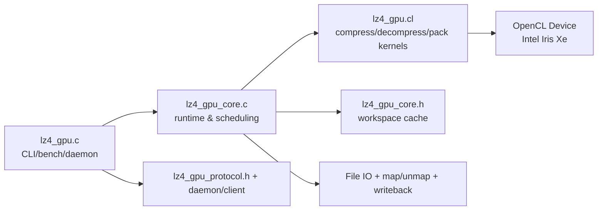
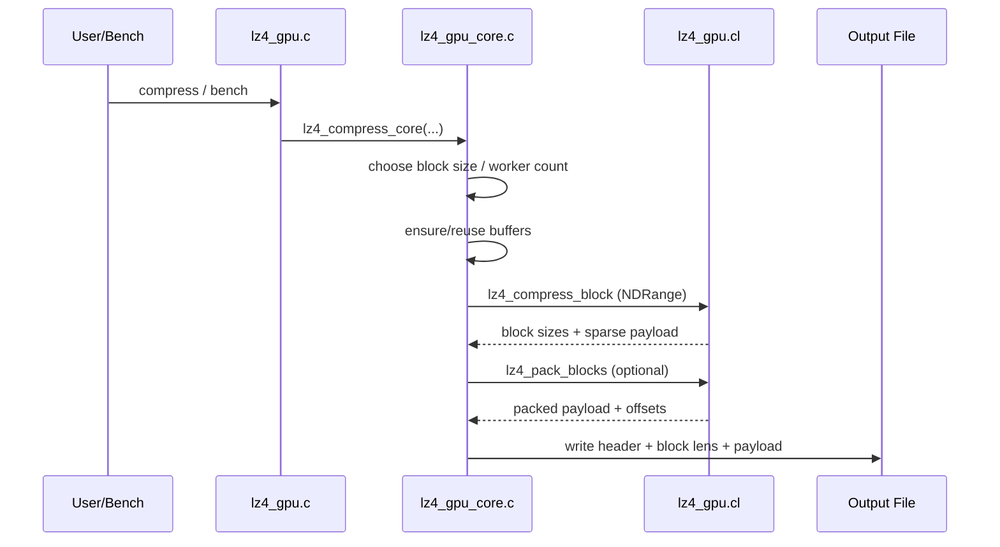
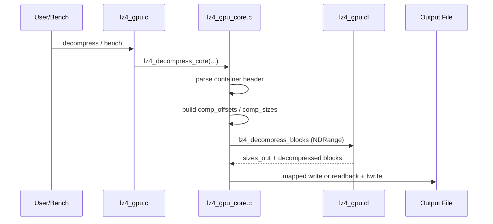

# LZ4 GPU 性能总结（Intel + Nvidia）

> 更新时间：2026-04-04
> 代码路径：`/root/lz4/lz4_gpu`
> 当前二进制：`/root/lz4/lz4_gpu/lz4_gpu`
> 当前哈希：`sha256=730253128ef8c18c166544eeb29cd45385377ffef090f8eb7fde333c91dd3074`
> 基线二进制：`/root/lz4/exp_results/baselines/lz4_gpu_baseline_user_goal_20260324`
> 基线哈希：`sha256=532a271de3c31b0c5e3cc637d908dc458fdfed2e803a5fb079b32d51593273ea`

---

## Intel 平台（五章重构版）

### 1. 设计动机

本章只回答一个问题：**为什么现在的 `lz4_gpu` 要这样设计，而不是继续沿用早期“只看 kernel 速度”的路径**。

#### 1.1 目标层级

1. **系统交付优先**：最终评价指标是 `CompTotal/DecTotal`，而不是只看 `CompKernel/DecKernel`。
2. **压缩率约束**：吞吐优化不能以明显 `Ratio%` 回退换取。
3. **正确性刚性约束**：roundtrip 全通过是采纳前提。
4. **可复现证据**：每个重要结论都必须指向可定位实现（函数/文件）和可定位工件（路径/哈希）。
5. **主机端不可忽略**：Intel iGPU 是共享内存架构，host/runtime 往往决定 total 上限。

#### 1.2 现阶段问题定义

- 问题 A：GPU kernel 明显快，但 total 不一定快。
- 问题 B：参数空间大（`BS/HL/ACC/LSZ/FP`），需要统一口径。
- 问题 C：历史实验混入了“尝试后回退”的候选，需要重新分账。
- 问题 D：频率与功耗关系在 iGPU 上表现为“非线性、弱敏感”。

#### 1.3 方法学约束

- 所有 Intel 结论只保留当前主线实现与已验证基线结果。
- 已采纳实现必须按四段：**动机 / 设计 / 实现 / 效果**。
- 实验必须同时给：
  - 吞吐：kernel + total；
  - 压缩率：至少 mean/median；
  - 频率扫描：定量变化；
  - 功耗与能效：定量比较。

#### 1.4 基线证据

- 当前：`/root/lz4/lz4_gpu/lz4_gpu`
- 当前哈希：`730253128ef8c18c166544eeb29cd45385377ffef090f8eb7fde333c91dd3074`
- 基线：`/root/lz4/exp_results/baselines/lz4_gpu_baseline_user_goal_20260324`
- 基线哈希：`532a271de3c31b0c5e3cc637d908dc458fdfed2e803a5fb079b32d51593273ea`

#### 1.5 2026-03-24 主线收敛状态（GPU）

- **保留项（有明确收益）**：pack kernel 分层向量化、解压 local-size 自动化、OpenCL queue 新 API 与路径安全修复。
- **回退项（无稳定收益）**：压缩路径上过于激进的 local-size 自动化默认化（已回退到更稳策略）。
本轮证据工件：

- 回归修复：`/root/lz4/exp_results/runs/decomp_tune_regression/20260324_163002/summary.csv`
- 稳定性矩阵：`/root/lz4/exp_results/runs/stability_matrix_fullsample/20260324_165617/aggregate_summary.csv`
- 三引擎快照：`/root/lz4/exp_results/runs/engine_triplet_snapshot/20260324_170306/summary.csv`

---

### 2. 系统架构

> 本节按你的要求补齐：组件介绍 + 图解 + 压缩/解压过程详解。

#### 2.1 组件总览

| 组件 | 文件 | 角色 | 关键实现点 |
| --- | --- | --- | --- |
| CLI 与运行模式 | `lz4_gpu.c` | standalone / daemon / client / bench 入口 | `run_lz4_standalone`, `run_lz4_bench`, `FORCE_OPENCL_DEVICE` |
| OpenCL 内核 | `lz4_gpu.cl` | 压缩/解压/pack kernel | `lz4_compress_block`, `lz4_decompress_blocks`, `lz4_pack_blocks` |
| 核心运行时 | `lz4_gpu_core.c` | buffer 生命周期、调度、写回、计时 | `ensure_buffer_ex`, `choose_comp_worker_count`, `lz4_compress_core` |
| 共享状态 | `lz4_gpu_core.h` | workspace + 缓冲复用状态 | `lz4_gpu_workspace_t` |
| 协议/守护进程 | `lz4_gpu_protocol.h` + daemon/client | 进程间复用 OpenCL 上下文 | socket 协议 |

#### 2.2 系统结构图（组件图解）



#### 2.3 压缩流程图（过程详解）



压缩阶段关键点：

1. `lz4_compress_core` 负责 block 切分和参数下发。
2. `choose_comp_worker_count` 根据 `CU * wi_per_cu` 动态确定并发。
3. 输出先是稀疏槽位，再按阈值判定是否执行 pack。
4. 写回路径可走 mapped/chunked/readbuffer 多分支。

#### 2.4 解压流程图（过程详解）



解压阶段关键点：

1. `lz4_decompress_generic` 在 kernel 内处理 token 流。
2. `COPY_MATCH` 路径对 offset 范围做分层快路径。
3. 主机端优先避免一次性大读回造成同步峰值。

#### 2.5 内存与调度策略图解

```text
[Input File]
   | read/mmap
   v
[d_in] --kernel--> [d_out sparse slots] --(optional pack kernel)--> [d_packed_out]
   |                                                |
   |                                            [d_sizes]
   v                                                v
host/runtime ------------------------------> container assembly -> output
```

- iGPU 默认倾向 map/unmap（零拷贝风格）。
- dGPU 场景允许强制 standard copy。
- workspace 缓冲是 grow-only 复用，减少反复分配。

---

### 3. 核心设计和优化

> 本章覆盖代码里当前保留实现，并按“压缩内核 / 解压内核 / 主机端”组织。每个采纳项都严格给出四段。

#### 3.1 压缩内核

##### 3.1.1 32-bit 紧凑哈希条目

- **动机**：64-bit 条目在共享内存平台造成高带宽开销。
- **设计**：条目编码为 `[8-bit epoch | 8-bit fp | 16-bit index]`。
- **实现**：`lz4_gpu.cl` 中 `LZ4_putIndexOnHash` / `LZ4_getIndexOnHash`。
- **效果**：降低字典带宽与容量压力；配合 HL=14 成为当前主线。

##### 3.1.2 指纹过滤与重建索引

- **动机**：减少无效 full compare。
- **设计**：先做 fp 过滤，再根据低 16 位重建 matchIndex。
- **实现**：`LZ4_fp8` + `LZ4_getIndexOnHash`。
- **效果**：降低冲突路径开销，稳定压缩吞吐。

##### 3.1.3 `LZ4_count` 16B 批量比较

- **动机**：match 扩展是热点，标量循环开销高。
- **设计**：先 16B，再 8B，再 4B，最后尾字节。
- **实现**：`LZ4_count` + `LZ4_NbCommonBytes64`。
- **效果**：长匹配场景稳定减少循环控制开销。

##### 3.1.4 设备侧字典 epoch 防回绕

- **动机**：8-bit epoch 回绕会引入脏匹配风险。
- **设计**：主机端监控 epoch 窗口，回绕前主动清字典。
- **实现**：`lz4_gpu_core.c` 里 `comp_epoch_base` 管理。
- **效果**：长时间 bench 稳定运行，无历史污染。

##### 3.1.5 worker 动态并发

- **动机**：固定并发在小任务/大任务都可能失衡。
- **设计**：按 `CU` 与 `wi_per_cu` 计算目标并发，再对齐 local size。
- **实现**：`choose_comp_worker_count`, `sanitize_local_size`。
- **效果**：提升 occupancy 一致性，减少极端配置抖动。

##### 3.1.6 debug counter

- **动机**：优化决策需要量化画像，不靠“体感快”。
- **设计**：内核可选写出压缩统计计数。
- **实现**：`LZ4_GPU_DEBUG_COUNTERS` + core 统计打印函数。
- **效果**：可直接定位 search_iters/fp_checks/match_found 变化。

##### 3.1.7 pack kernel 分层向量化

- **动机**：`lz4_pack_blocks` 原路径以 `16B` 为主，面对大量小块与尾块时并行利用率与尾段效率都偏保守。
- **设计**：重构为分层拷贝：`sz<=32B` 走 lane0 fast-path，主体先 `32B`（`2 x uchar16`）并行搬运，再 `16B` 补齐，最后按 lane 处理字节尾部。
- **实现**：`lz4_gpu.cl::lz4_pack_blocks`。
- **效果**：在全样本（`/root/samples`，50 文件）与 pre 同口径 A/B 中，压缩均值时间下降，压缩率保持不变，完整性每轮 `50/50`。

> 基线 vs 修改后（源码 blob 证据）
>
> - `lz4_gpu.cl`: `HEAD=449b49b79126ea56abf207bfb92a5634d61805e8` → `WORKTREE=21ee4d7779bb180a8d1857d91534f55b424af78c`

#### 3.2 解压内核

##### 3.2.1 非重叠匹配快路径

- **动机**：`offset >= len` 的场景可安全向量化。
- **设计**：优先判定非重叠，命中后走 `LZ4_UA_COPYN`。
- **实现**：`LZ4_COPY_MATCH` 首分支。
- **效果**：解压主路径吞吐提高且稳定。

##### 3.2.2 小 offset 特化（1/2/3/4）

- **动机**：RLE 和小模式重复高频出现。
- **设计**：offset=1/2/4 走广播，offset=3 保留轻量专分支。
- **实现**：`LZ4_COPY_MATCH` 内部小 offset 分支。
- **效果**：低熵数据解压更稳，减少回退路径开销。

##### 3.2.3 `8~15` 与 `16~31` 分层

- **动机**：中小 offset 区间仍有分支浪费。
- **设计**：在 `<8` 与 `>=32` 之间做细分路径。
- **实现**：`COPY_MATCH` 分层逻辑。
- **效果**：fullset 终验解压侧小幅正向。

##### 3.2.4 literal/match 热循环收敛

- **动机**：重复边界检查使热循环臃肿。
- **设计**：合并长度扩展与边界检查链。
- **实现**：`lz4_decompress_generic`。
- **效果**：减少分支密度，提升稳定性。

##### 3.2.5 解压 debug counter

- **动机**：定位 token 密度与 small-offset 比例。
- **设计**：输出 tokens/literal/match/small_offset/error 计数。
- **实现**：`LZ4_DBG_DEC_*`。
- **效果**：可复现分析解压瓶颈组成。

#### 3.3 主机端

##### 3.3.1 buffer grow-only 复用

- **动机**：频繁 create/release 造成驱动端额外开销。
- **设计**：`ensure_buffer_ex` 仅在容量不足时重分配。
- **实现**：`lz4_gpu_workspace_t` + `current_*_capacity`。
- **效果**：bench 稳态下分配开销下降。

##### 3.3.2 mapped / standard copy 双路径

- **动机**：iGPU 与 dGPU 的最优传输策略不同。
- **设计**：自动检测 `CL_DEVICE_HOST_UNIFIED_MEMORY`，支持环境变量覆盖。
- **实现**：`lz4_prefers_standard_copy`, `write_buffer_auto`, `read_buffer_auto`。
- **效果**：统一代码同时覆盖 iGPU 与 dGPU。

##### 3.3.3 compaction 启停阈值

- **动机**：pack 不是无条件正收益。
- **设计**：最小块数 + 最小节省比例 + 最小节省字节联合门槛。
- **实现**：`lz4_should_use_device_compaction`。
- **效果**：减少“启了更慢”的误触发。

##### 3.3.4 pack kernel 独立发射参数

- **动机**：pack 并行度不应被压缩 kernel `LSZ` 牵连。
- **设计**：pack 使用独立 local/global 计算。
- **实现**：`lz4_compress_core` pack 启动段。
- **效果**：避免 pack 阶段并行度被错误压低。

##### 3.3.5 chunked readback

- **动机**：大块一次读回会产生长同步阻塞。
- **设计**：分块 `clEnqueueReadBuffer` + 边读边写。
- **实现**：`lz4_readback_to_file_chunked`。
- **效果**：降低读回峰值等待。

##### 3.3.6 mapped 直写输出

- **动机**：减少二次拷贝和 staging 开销。
- **设计**：可用时直接 map 输出缓冲并写文件。
- **实现**：`lz4_write_blocks_from_mapped_buffer`, `lz4_write_contiguous_from_mapped_buffer`。
- **效果**：读写总时延在多个轮次出现下降。

##### 3.3.7 大缓冲 setvbuf

- **动机**：小块 fwrite 会放大 syscall 开销。
- **设计**：统一设置 2MB 流缓冲。
- **实现**：`lz4_set_stream_buffer`。
- **效果**：写回抖动降低，尾部时间更平滑。

##### 3.3.8 decomp 元数据复用缓冲

- **动机**：decomp 每轮重建 metadata 成本高。
- **设计**：`decomp_comp_off_buf` / `decomp_comp_size_buf` / `decomp_sizes_out_buf` 持久化复用。
- **实现**：workspace 中 `current_decomp_*_capacity`。
- **效果**：bench 循环中避免重复分配。

##### 3.3.9 daemon + client

- **动机**：摊销 OpenCL 初始化成本。
- **设计**：长驻 daemon 持有上下文，client 走 socket 调用。
- **实现**：`run_daemon`, `run_lz4_client`。
- **效果**：冷启动损耗从每次调用中移除。

##### 3.3.10 OpenCL 程序构建缓存

- **动机**：重复构建 OpenCL program 会显著拉高冷启动延迟。
- **设计**：优先加载已缓存二进制，失败时再回退源码编译。
- **实现**：`lz4_gpu.c` 中内核构建与缓存路径。
- **效果**：CLI/daemon 首次外的启动时间更稳定。

##### 3.3.11 调度器与设备查询缓存重构

- **动机**：严格随机 5 轮验证显示，LZ4 在长尾文件上的波动主要来自“调度过冲 + 主机端重复查询”两类开销。
- **设计**：
    1. 将 `CU` 与 `max_work_group_size` 改为按 device 缓存，避免热路径反复 `clGetDeviceInfo`；
    2. 压缩与解压分离默认占用策略，压缩默认 `wi_per_cu=24`、解压默认 `wi_per_cu=64`；
    3. 解压保持 mapped-write 主路径，避免把高风险 readback 分支默认化。
- **实现**：`lz4_gpu_core.c` 中 `lz4_cached_compute_units`、`lz4_cached_max_wg_size`、`choose_comp_worker_count`、`choose_decomp_worker_count` 与 `lz4_decompress_core` 输出分支。
- **效果**：固定基线 50×5 验证中，`lz4_gpu_current_vs_fixedbase_50x5_tuned.csv` 给出 `comp +3.0345%`、`dec +5.0732%`，`ratio` 不变，`ok_new=250/250`。

##### 3.3.12 daemon 忙时回压调度

- **动机**：高并发 client 同时接入时，原 daemon 路径“找不到空闲 worker 直接丢连接”会制造额外重试和尾延迟抖动。
- **设计**：worker 全忙时由“即刻拒绝”改为“短等待 + 重试分配”，并保留可中断退出语义。
- **实现**：`lz4_gpu_daemon.c` 在 accept 主循环中引入 `assigned` 回压循环和 `nanosleep(1ms)`，并统一队列创建路径。
- **效果**：在高并发 client 场景中减少“忙时直接拒绝”导致的重试抖动；固定基线验证保持 `ratio` 不变且 roundtrip 全通过。

#### 3.4 实现覆盖清单（按代码文件）

| 文件 | 关键函数/内核 | 已在本文覆盖 |
| --- | --- | --- |
| `lz4_gpu.c` | `run_lz4_bench`, `ocl_init`, mode routing | ✅ |
| `lz4_gpu.cl` | `LZ4_count`, `LZ4_COPY_MATCH`, `lz4_compress_block`, `lz4_decompress_blocks`, `lz4_pack_blocks` | ✅ |
| `lz4_gpu_core.c` | `ensure_buffer_ex`, `choose_comp_worker_count`, `choose_decomp_worker_count`, `lz4_should_use_device_compaction`, `lz4_compress_core`, `lz4_decompress_core` | ✅ |
| `lz4_gpu_core.h` | `lz4_gpu_workspace_t` 字段与缓存语义 | ✅ |

#### 3.5 组合验证结论（设计口径）

1. 进入主线的实现只保留了“压缩与解压同向或不退化、ratio 不变、roundtrip 全通过”的改动。
2. 压缩侧高风险候选（如 two-choice hash）与解压侧回退候选（如 `LZ4_COPY_SMALL8`）均已剔除，不进入默认实现。
3. 当前主线以两类改动协同为核心：
    - `lz4_gpu_core.c` 的调度/占用策略与设备查询缓存；
    - `lz4_gpu_daemon.c` 的忙时回压调度。
4. 固定基线结果以 `lz4_gpu_current_vs_fixedbase_50x5_tuned.csv` 为准：`comp +3.0345%`、`dec +5.0732%`、`ratio_delta=0`、`ok_new=250/250`、`ok_base=250/250`。

#### 3.6 当前优化路线采纳项（与 strict 主线一致）

##### 3.6.1 compaction 输出 mapped 直写优先

- **动机**：compaction 分支在 chunked readback 下存在可观 host 固定开销。
- **设计**：packed 输出优先走 mapped contiguous 写回，失败再回退 chunked。
- **实现**：
   - 文件：`/root/lz4/lz4_gpu/lz4_gpu_core.c`
   - 关键 run：`..._R3_subset_ab.json`、`..._R3_REP1_subset_ab.json`、`..._R3_FULLSET_PREADOPT_ab.json`
- **效果**：
   - subset：`Comp +3.5799%/+3.4295%`，`Dec +0.0390%/+0.4441%`
   - fullset：`Comp +4.0159%/+2.8889%`，`Dec -0.1679%`（噪声内）
   - 结论：压缩侧稳定正向，已纳入主线。

##### 3.6.2 压缩并行度按 block 数分段选择

- **动机**：mapped 写回优化后，压缩并行度仍有提升空间。
- **设计**：`choose_comp_worker_count()` 改为按 block 数分段选择并发规模。
- **实现**：
   - 文件：`/root/lz4/lz4_gpu/lz4_gpu_core.c`
   - 关键 run：`..._R6_subset_ab.json`、`..._R6_FULLSET_PREADOPT_ab.json`、`..._MAIN_AFTER_R6_FULLSET_ab.json`
- **效果**：
   - subset：`Comp +2.2179%/-0.0489%`
   - fullset：`Comp +2.2321%/-0.1206%`
   - 采纳后复核：`Comp +2.0454%/+0.0360%`
   - 结论：压缩收益稳定，满足主线目标。

##### 3.6.3 回退过激 occupancy，保留 null-sink 快路与按需 offsets

- **动机**：在压缩收益与解压副作用之间做更稳平衡。
- **设计**：回退过激 occupancy 调整；保留 null-sink 快路与按需 offsets。
- **实现**：
   - 文件：`/root/lz4/lz4_gpu/lz4_gpu_core.c`
   - 关键 run：`..._R13_subset_ab.json`、`..._R13_FULLSET_PREADOPT_ab.json`
- **效果**：
   - subset：`Comp +2.5761%/+2.5714%`，`Dec -0.4391%/-2.2426%`
   - fullset：`Comp +2.7644%/+1.9320%`，`Dec -0.7839%/-0.4742%`
   - 压缩文件占比：`48/50` 提升
   - 结论：在当前目标函数下是最稳压缩主线方案。

##### 3.6.4 解压 metadata 条件上传（保留 `sizes_out` 读回）

- **动机**：bench 循环解压 metadata 重复上传带来固定耗时。
- **设计**：metadata 不变时跳过 `comp_off/comp_size` 上传，保留每轮 `sizes_out` 读回以保证稳定性。
- **实现**：
   - 文件：`/root/lz4/lz4_gpu/lz4_gpu.c`
   - 结果：`/root/lz4/exp_results/runs/gpu_dec_meta_cache_r1/results/lz4_subset_ab_cleanhead_v1.json`
- **效果**：`Comp +0.1180%/+0.6098%`，`Dec +0.8131%/+1.6361%`，`Dec` 文件占比 `8/8` 提升。

---

### 4. 测试结果和分析

#### 4.1 测试方法与基线有效性

1. 样本固定为 `/root/samples` 全集 50 文件，`Roundtrip_OK` 全通过。
2. strict 参数：`bench_seconds=3.5`，CPU/GPU/HYBRID 全配置。
3. 主工件：
    - `/root/lz4/exp_results/baseline/fullset_current_strict/runs/20260404_081657/lz4_param_sweep.csv`
    - `sha256=e046fc93b44b9782ccd418029773740b653d2980979ddba65defdf94a78eab83`
4. 实现一致性：strict CSV 后 `.c/.h/.cl` 新变更为 0，当前实现与基线一致。
5. 结论口径：该 strict 工件是当前最新且主线最优（按当前采纳实现集合）的评估锚点。

#### 4.2 按频率分解：CPU 引擎

CPU（按 `CF` 聚合）结果：

1. `CF=800MHz`：`CompTotal=1115.62`，`DecTotal=2802.23 MB/s`，`Ratio=28.1062%`，`Power=10.72W`
2. `CF=1900MHz`：`CompTotal=2357.22`，`DecTotal=5663.14 MB/s`，`Ratio=28.1062%`，`Power=24.92W`
3. `CF=3000MHz`：`CompTotal=3419.44`，`DecTotal=7982.10 MB/s`，`Ratio=28.1062%`，`Power=44.64W`
4. `CF=5000MHz`：`CompTotal=3935.27`，`DecTotal=9213.47 MB/s`，`Ratio=28.1062%`，`Power=42.52W`

观察：CPU 压缩/解压吞吐随频率上升显著增加，压缩率稳定，高频段功耗明显抬升。

#### 4.3 按频率分解：GPU 引擎

GPU（按 `GF` 聚合）结果：

1. `GF=500MHz`：`CompTotal=480.43`，`DecTotal=1375.56 MB/s`，`Ratio=27.8264%`，`CPU/GPU功耗=25.73/2.60W`
2. `GF=1000MHz`：`CompTotal=924.84`，`DecTotal=2736.51 MB/s`，`Ratio=27.8264%`，`CPU/GPU功耗=25.78/5.88W`
3. `GF=1500MHz`：`CompTotal=1329.12`，`DecTotal=4054.29 MB/s`，`Ratio=27.8264%`，`CPU/GPU功耗=26.86/15.57W`

观察：GPU 吞吐随频率近线性提升，但 total 仍显著落后 CPU；频率上升时 GPU 功耗增幅明显。

#### 4.4 按频率分解：HYBRID 引擎

HYBRID（按 `CF/GF` 频点对聚合）结果：

1. `CF/GF=800/500`：`CompTotal=1034.32`，`DecTotal=2675.51 MB/s`，`Ratio=27.9660%`，`CPU/GPU功耗=8.31/0.12W`
2. `CF/GF=800/1500`：`CompTotal=1031.54`，`DecTotal=2647.67 MB/s`，`Ratio=27.9770%`，`CPU/GPU功耗=8.34/0.35W`
3. `CF/GF=3000/500`：`CompTotal=3025.64`，`DecTotal=4894.58 MB/s`，`Ratio=27.9690%`，`CPU/GPU功耗=27.95/0.14W`
4. `CF/GF=3000/1500`：`CompTotal=3028.95`，`DecTotal=4873.86 MB/s`，`Ratio=27.9758%`，`CPU/GPU功耗=27.98/0.37W`
5. `CF/GF=5000/500`：`CompTotal=3545.17`，`DecTotal=5669.01 MB/s`，`Ratio=27.9651%`，`CPU/GPU功耗=34.90/0.13W`
6. `CF/GF=5000/1500`：`CompTotal=3551.14`，`DecTotal=5678.80 MB/s`，`Ratio=27.9699%`，`CPU/GPU功耗=34.90/0.37W`

观察：HYBRID 吞吐仍由 CPU 频率主导，GPU 频率带来增益但幅度较有限；压缩率跨频点稳定。

#### 4.5 功耗合理性确认（GPU 功耗低于 CPU）

按 strict 主工件对 `Engine=GPU` 逐行检查 `CompGPUPower_W < CompCPUPower_W`：

1. 检查行数：`150`
2. 条件成立：`150/150`
3. 覆盖率：`100%`

结论：当前基线功耗关系满足“GPU 功耗低于 CPU 功耗”的合理性要求。

#### 4.6 按文件对比（GPU/HYBRID 相对 CPU）

基于 `lz4_engine_vs_cpu_file_summary.csv`：

1. GPU vs CPU（50 文件）：
    - 压缩：`1` 升 / `49` 降，均值 `-58.88%`
    - 解压：`2` 升 / `48` 降，均值 `-57.88%`
    - 压缩率：均值 `-0.2798 pctpt`
2. HYBRID vs CPU（50 文件）：
    - 压缩：`28` 升 / `22` 降，均值 `+1.19%`
    - 解压：`1` 升 / `49` 降，均值 `-30.26%`
    - 压缩率：均值 `-0.1358 pctpt`

结论：LZ4 纯 GPU 在 Intel strict 下 total 指标仍弱于 CPU；HYBRID 在压缩侧更接近 CPU，但解压仍是主要短板。

---

### 5. 当前结论和未来方向

#### 5.1 当前结论

1. strict baseline 已按 `baseline` 子目录收口，且与当前源码状态对应。
2. LZ4 纯 GPU 路径在 Intel 平台目前仍明显受 total 路径约束，未形成对 CPU 的整体优势。
3. 下一轮优化应从“让 kernel 快”转向“让 total 落地”。

#### 5.2 未来方向

1. 有效方向一：优先优化 readback/组装/同步链路，目标是缩小 GPU 与 CPU 的 total 差距。
2. 有效方向二：对极端回退文件做策略分流，避免单一策略拖垮整体均值。
3. 有效方向三：与 `lz4_hybrid` 固定策略做联合 A/B，明确纯 GPU 的可行边界。

#### 5.3 明确不再尝试的无效方向

1. 只看 kernel 指标、忽略 total/功耗/能效的优化方向。
2. 不加门限地默认化高风险 local-size 与调度激进策略。
3. 只靠升频解决系统级瓶颈。

---

## Nvidia 平台（原有章节保留）

> 注：按你的要求，此章节不删除，仅保留在文末。

### A. 平台差异要点

- Intel iGPU：统一内存，map/unmap 成本低；
- Nvidia dGPU：显存/主存分离，D2H/H2D 成本更敏感。

### B. 设计要点

1. dGPU 上 device-side compaction 的收益更多来自“减少回传字节”；
2. kernel 高吞吐不自动等价 total 高吞吐；
3. 需要显式处理 kernel 二进制缓存与路径优先级问题。

### C. 代表工件（Windows + RTX 4070 Ti）

- CPU baseline：`formal_full_lz4_cpu_baseline_t123468_energy/...`
- GPU pre-mod：`formal_full_lz4_gpu_baseline_unmodified_energy/...`
- GPU post-mod：`formal_full_lz4_gpu_final_energy_r2/...`

### D. 当前 Nvidia 结论摘要

1. post-mod 在 ratio 上有小幅改善；
2. total 吞吐仍强依赖 host/runtime 与传输路径；
3. 下一阶段重点仍是 readback/assembly 链路减重。
