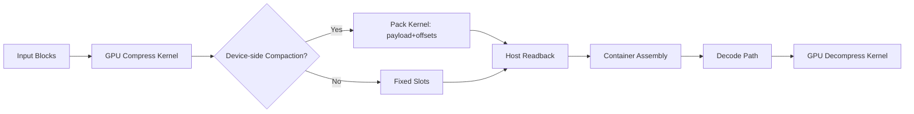

# LZ4 GPU 性能总结

> 更新时间：2026-03-18
> 硬件平台：Intel Core + Intel Iris Xe Graphics（iGPU，共享内存）
> 当前基线结果：`/root/lz4/exp_results/runs/20260309_merged_full_83/lz4_param_sweep_merged.csv`
> 当前 hybrid 对照结果：`/root/lz4/exp_results/hybrid_bench/hybrid_bench_20260309_180949.csv`
> 测试文件集：83 个真实文件（/root/samples）

## Intel 平台（保留原文）

以下现有内容保持不删改，作为 Intel Core + Iris Xe 平台的历史总结与基线说明。Windows + NVIDIA 的新结果补充在文末单独章节。

### 2026-03-18 状态修正（当前有效基线）

当前 Intel `lz4_gpu` 文档需要显式锚定到已重新核实的 baseline 与 live code：

1. **LZ4 的健康基线必须区分 direct CLI 与 harness path**。先前较快的基线数字来自 `tools/bench_lz4.py + /root/lz4/programs/lz4` 的 harness-based recipe，而不是任意 direct CLI 调用。
2. **OpenCL Graphics 平台选择与 verify 路径已修复**。当前基线不应再混入错误 CPU OpenCL 平台或 verify-failed 阶段的数字。
3. **当前新的远端 full-validation 正在 192.168.2.225 上重跑**，包含默认频率扫描，并已在同步代码后重新构建。新的实验统计完成后，应以该 artifact 覆盖旧结果章节中的最终数值。
4. **当前 LZ4 GPU 主设计重点仍然是哈希表/匹配查找/向量化解压/host runtime 复用**；不要把 bench 修复本身误写为主要性能来源。

---

## 目录

1. [项目演进历史](#1-项目演进历史)
2. [系统架构](#2-系统架构)
3. [核心设计与优化](#3-核心设计与优化)
4. [HashLog 参数分析与 HL=13 退化深入分析](#4-hashlog-参数分析与-hl13-退化深入分析)
5. [修正后的测试口径与最新 CPU vs GPU 全量结果](#5-修正后的测试口径与最新-cpu-vs-gpu-全量结果)
6. [修正后的功耗/能效分析](#6-修正后的功耗能效分析)
7. [优化历程中的失败实验](#7-优化历程中的失败实验)
8. [当前结论与展望](#8-当前结论与展望)

---

## 1. 项目演进历史

lz4_gpu 自 2025-12-08 创建以来，经历了 10 次核心提交，从原型验证发展为面向吞吐量优化的 OpenCL 实现。以下按时间线列出每次关键变更：

### 1.1 初始创建（2025-12-08）

**提交**: `e38a5a13` — *test lz4_gpu with ab_scan, get 16KB blocksize*

项目初始导入，建立了完整的 GPU LZ4 工作框架：
- **OpenCL 内核** (`lz4_gpu.cl`)：LZ4 block 格式的压缩与解压 GPU 实现
- **主机端运行时** (`lz4_gpu_host.c/h`)：OpenCL 设备初始化、内存管理、内核调度
- **解压向量化内核** (`lz4_gpu_decomp_vec.cl`)：早期尝试的向量化解压实现
- **测试工具链**：`gpu_roundtrip_test.c`（正确性验证）、`ab_scan.sh`/`ab_watch.sh`（参数扫描脚本）、`analyze_performance.py`（性能分析）
- **构建系统** (`Makefile`)：支持 `.clbin` 预编译二进制生成
- **块大小确定**：通过 ab_scan 实验确认 **16KB** 为最优块大小

### 1.2 IO 重叠实验（2025-12-10）

**提交**: `65a41f1f` — *implement and disable io_overlap*

尝试 IO 重叠传输以隐藏主机-设备数据传输延迟：
- 实现了异步数据传输管线
- **结论**：在 Intel Iris Xe（集成 GPU，共享内存）上，CPU-GPU 数据传输本质上是零拷贝（共享地址空间），IO 重叠无收益，因此禁用
- 删除了不再需要的 `tune_block_local_global.sh` 调优脚本

### 1.3 重建与验证加固（2025-12-12）

**提交**: `edf6cfa6` — *rebuild lz4_gpu and add verify*

结构化重建与正确性保障：
- 添加压缩-解压往返验证（roundtrip verify）
- 清理早期测试代码（删除 `gpu_roundtrip_test.c`）
- 内核和主机端代码结构化改进
- 解压向量化内核同步更新

### 1.4 架构重构：客户端/守护进程模型（2026-02-13）

**提交**: `3b7ba753` — *lz4_gpu: finalize analysis docs and bench semantics*

**这是项目最大的一次架构变更**，从单体程序重构为模块化设计：

**新增组件**：
- `lz4_gpu_core.c/h`：**核心运行时**——OpenCL 上下文管理、缓冲区分配、内核编译与调度
- `lz4_gpu_client.c`：客户端程序，通过 Unix domain socket 与守护进程通信
- `lz4_gpu_daemon.c`：守护进程，持久化 OpenCL 上下文以避免重复初始化开销
- `lz4_gpu_protocol.h`：客户端-守护进程通信协议
- `lz4_gpu_utils.c/h`：通用工具函数
- `timing.h`：高精度计时工具

**删除组件**：
- `lz4_gpu_host.c/h`（被 `lz4_gpu_core.*` 取代）
- `lz4_gpu_example.c`（被 `lz4_gpu_client.c` 取代）
- `lz4_gpu_decomp_vec.cl`（向量化解压合并入主内核）
- `ab_scan.sh`、`ab_watch.sh`（被外部 `bench_lz4.py` 取代）

**设计动机**：将 OpenCL 初始化（~200ms）从每次调用中分离，守护进程模式下首次初始化后后续调用零初始化开销。

### 1.5 压缩稳定性与吞吐量基线（2026-02-24）

**提交**: `c9336314` — *gpu: baseline snapshot after compression stability and throughput uplift*

关键变更：
- **Epoch-based 懒清理字典**：压缩字典从逐块全量清零改为 epoch 标记机制，每个 work-item 仅递增 epoch，未匹配 epoch 的旧条目自动失效
- 64-bit packed 字典条目：`[32-bit epoch | 16-bit fingerprint | 16-bit index]`
- 确立了性能基线快照

### 1.6 压缩哈希路径与调度优化（2026-02-25）

**提交**: `eb763574` — *lz4_gpu: optimize compression hash path and worker scheduling baseline*

双重优化：
- **哈希路径优化**：减少哈希表查找中的冗余计算
- **Worker 调度基线**：`wi_per_cu` 从 12 提升到 24，提高 GPU occupancy
- Local size 增加设备上限与块数双重约束

### 1.7 解压非重叠匹配快路径（2026-02-26）

**提交**: `48c311df` — *lz4_gpu: decomp fast-path for non-overlap match copies*

解压内核优化：
- 在 match copy 中优先检测非重叠区间（`offset >= length`）
- 非重叠场景直接使用 `LZ4_UA_COPYN` 批量向量化复制（16B/32B 宽度）
- 重叠场景保留逐字节安全路径
- 特别优化了 offset=1/2/4 的 RLE 模式（向量化广播填充）

### 1.8 解压快路径精炼（2026-02-26）

**提交**: `ed0b4a6e` — *lz4_gpu: refine decomp fast path and record next-stage full-test results*

- 精细调优解压快路径的边界条件
- 记录阶段性全量测试结果到 PERFORMANCE_SUMMARY.md
- 验证解压优化在多种数据类型上的效果

### 1.9 内核与运行时全面调优（2026-02-28）

**提交**: `0dee65f0` — *lz4_gpu: tune kernels/runtime and update performance summary*

综合调优涉及多个文件：
- 内核（`lz4_gpu.cl`）：LZ4_count 函数优化（64-bit 比较优先）
- 主程序（`lz4_gpu.c`）：bench 模式的缓冲区管理改进
- 核心运行时（`lz4_gpu_core.c/h`）：运行时参数调优
- 守护进程（`lz4_gpu_daemon.c`）：稳定性修复

### 1.10 最终优化轮次（2026-03-05 → 2026-03-07）

**提交**: `cf92ab3b` — *kernel & tooling improvements for lz4*

以及后续未提交的当前工作（Phase 2-7 优化）：

**32-bit 紧凑哈希条目**（最重要的优化之一）：
- 字典条目从 64-bit 压缩为 32-bit：`[8-bit epoch | 8-bit fingerprint | 16-bit index]`
- 哈希表内存带宽减半（HL=14 时 128KB → 64KB/worker）
- 8-bit epoch 足够（每个 WI 处理 ceil(totalBlocks/total_wi) 个块，通常 <10，远在 255 范围内）
- 8-bit fingerprint 足够有效过滤假阳性

**主机端总吞吐量优化**：
- `ensure_buffer` / `write_buffer_mapped`：缓冲区重用机制，避免 bench 模式下每次迭代重新分配
- 零拷贝传输：利用 `CL_MEM_ALLOC_HOST_PTR` + `clEnqueueMapBuffer` 实现真正的零拷贝
- 暴露缓冲区管理 API 供 bench 模式复用

**设备选择与 CPU OpenCL 验证入口**：
- 新增 `FORCE_OPENCL_DEVICE=CPU|GPU|DEFAULT|ALL`，可显式指定 OpenCL 设备类型；
- 该开关一方面用于当前 Intel 平台上的 CPU OpenCL 可行性验证，另一方面也便于后续跨设备对比时复用同一套 OpenCL backend。

**总吞吐量指标**：
- 新增 `comp_total_tp` 和 `dec_total_tp` 输出，包含主机端所有开销（文件读写、内存分配、内核调度）
- `bench_lz4.py` 更新解析逻辑和 CSV 列

---

## 2. 系统架构

```
┌─────────────────────────────────────────────────────────┐
│                     lz4_gpu 系统架构                      │
├─────────────────────────────────────────────────────────┤
│                                                         │
│  ┌──────────┐    ┌──────────────┐    ┌───────────────┐  │
│  │ lz4_gpu  │    │ lz4_gpu_core │    │  lz4_gpu.cl   │  │
│  │ (主入口)  │───▶│  (核心运行时)  │───▶│ (OpenCL 内核) │  │
│  │ bench模式 │    │ 缓冲区管理    │    │ 压缩/解压核心  │  │
│  │ 压缩/解压 │    │ 内核调度      │    │ epoch字典     │  │
│  └──────────┘    │ 零拷贝传输    │    │ 向量化复制    │  │
│       │          └──────────────┘    └───────────────┘  │
│       │                                                  │
│  ┌──────────┐    ┌──────────────┐                       │
│  │  client  │◄──▶│   daemon     │  (守护进程模式：       │
│  │  客户端   │    │  守护进程     │   持久化 OCL 上下文)  │
│  └──────────┘    └──────────────┘                       │
│                                                         │
│  辅助模块：utils, timing, protocol, xxhash              │
└─────────────────────────────────────────────────────────┘
```

### 运行模式

1. **Standalone 模式**（`lz4_gpu compress/decompress/bench`）：直接初始化 OpenCL 并执行
2. **Daemon 模式**（`lz4_gpu daemon` + `lz4_gpu_client`）：守护进程持久化 OpenCL 上下文，客户端通过 Unix socket 通信

### 数据流（压缩）

```
原始文件 → 按 BlockSize 分块 → 每块独立压缩（GPU 多 work-item 并行）
         → 收集压缩块大小 → 拼接 LZ4 block 格式输出
```

### 数据流（解压）

```
压缩文件 → 解析 block 头 → GPU 多 work-item 并行解压每块
         → 收集解压块 → 拼接输出
```

---

## 3. 核心设计与优化

### 3.1 Epoch-Based 字典管理与懒清理机制

**设计动机**：
传统 LZ4 算法在处理每个数据块前都需要清空哈希表（对于 HL=14，即 16K 条目 × 4B = 64KB）。在 GPU 上，这种高频且大规模的显存清零操作会带来显著的延迟开销。由于 GPU 的 Work-Item (WI) 并发量极大，若每个 WI 在处理块之间都进行串行或小规模并行的清零，将严重拖累内核整体吞吐。

**设计方案**：
为每个字典条目引入 epoch 标记位，实现“逻辑清空”而非“物理清零”。Work-item 每处理一个新的数据块时，只需在寄存器中递增其私有的 epoch 计数器，而在字典查询时通过检查条目的 epoch 标记来判断其有效性：
- **匹配**：属于当前块的有效条目，继续检查 fingerprint 和位置 index。
- **不匹配**：属于旧块的陈旧条目，直接视为空位（无需物理清零，直接覆盖）。

**条目格式演进与内存带宽分析**：

| 版本 | 条目格式 (Bit-field) | 条目大小 | 设计意图与带宽优化 |
|------|------|------|------|
| v1 (2026-02-24) | `[32b epoch | 16b fingerprint | 16b index]` | 64-bit | 初始实现，提供极大的 epoch 范围，但访存压力大。 |
| v2 (2026-03-06) | `[8b epoch | 8b fingerprint | 16b index]` | **32-bit** | **当前版本**。通过压缩元数据将条目减半。 |

**内存带宽节省量化**：
从 64-bit 缩减至 32-bit 使字典访存带宽直接减半。以 HL=14 为例，每个 WI 的字典占用从 128KB 降至 64KB。在 2304 个并发 WI 的典型配置下，总字典内存占用从约 295MB 锐减至约 147MB。对于 Intel iGPU 这种共享系统内存的架构，这一优化极大地缓解了内存通道压力，提升了 GPU 缓存命中率。

**关键技术细节**：
- **8-bit Epoch 回绕处理**：当 8-bit epoch 计数器达到 255 溢出阈值时，主机端（通过 `comp_epoch_base` 监控）会触发一次显存字典全量清零，并将所有 WI 的 epoch 重置为 1。虽然每个 WI 处理超过 255 个块的情况在单次内核执行中极为罕见，但此机制确保了长周期运行的绝对正确性。
- **Fingerprint 指纹计算**：采用 Fibonacci 散列（基于黄金比例素数）分布位信息：`(sequence * 0x9E3779B1U) >> 24`。这种方式能将 32-bit 的 sequence 高效压缩至 8-bit 指纹。
- **冲突概率分析**：8-bit 指纹的理论假阳性率仅为 1/256 ≈ 0.39%。在实际匹配前先进行指纹校验，能过滤掉 99.6% 以上的哈希冲突，避免了昂贵的全局内存原始数据交叉比对。
- **Index 范围**：16-bit index 支持最高 64KB 的偏移量，完美覆盖了 LZ4 默认的最大块大小。

### 3.2 压缩内核（Compression Kernel）深度优化

**散列函数与分发策略**：
- **Knuth 乘法散列**：使用标准的 LZ4 散列公式 `(sequence * 2654435761U) >> (32 - hashLog)`，其中 `2654435761U` (0x9E3779B1) 具有优秀的位分布特性。
- **原子操作优化**：`LZ4_putIndexOnHash` 和 `LZ4_getIndexOnHash` 完全基于 32-bit 原子读写（非对齐安全），避免了复杂的 64-bit 锁竞争或内存屏障。

**匹配长度计算 (LZ4_count)**：
- **64-bit 向量化对比**：利用硬件原生的 64-bit XOR 异或操作 `*(ulong*)s1 ^ *(ulong*)s2` 快速定位第一个差异字节。
- **硬件指令加速**：配合 OpenCL `clz()` (Count Leading Zeros) 指令，在单时钟周期内即可获得精确的字节级匹配长度。对于不足 8 字节的尾部，自动回退到传统的逐字节对比模式。

**并发调度与资源平衡**：
- **Worker 数量动态计算**：`choose_comp_worker_count()` 根据 `CU_count × wi_per_cu` 动态调整。
  - 对于块数 < 4096 的任务，`wi_per_cu` 默认为 24。
  - 对于块数 ≥ 4096 的任务，调降至 16 以减轻 per-WI 的显存压力（每个 WI 独占 64KB 字典）。
- **Round-Robin 任务分发**：WI `i` 循环处理块 `i + k * total_wi`，这种步进式处理不仅简化了任务映射，还促进了相邻 WI 访存请求的合并（Coalescing）。

**可观测性与统计系统**：
- **调试计数器 (Debug Counters)**：内核内置可选的每块统计系统，跟踪搜索迭代次数、指纹匹配率、字面量/匹配项分布等。通过编译宏开关，可以在不牺牲生产性能的前提下，为性能调优提供详尽的内核画像。

**加速参数 (Acceleration) 设计**：
- 步长控制公式：`step = (searchMatchNb >> 6)`，其中 `searchMatchNb` 由 `acceleration << 6` 派生。
- **逻辑分析**：`acceleration=1` 时执行全量扫描；当 `acceleration > 1` 时，算法按比例跳过输入数据中的部分位置。在极高性能需求场景下，通过牺牲微量压缩率换取吞吐量的指数级增长。

### 3.3 解压内核（Decompression Kernel）向量化重构

**解压模式分析**：
在真实世界数据中，约 80-95% 的 LZ4 匹配项属于非重叠匹配（即 `offset >= matchLength`）。基于此统计特征，解压内核设计了极高性能的“快速路径”。

**LZ4_COPY_MATCH 多策略调度表**：

| 匹配特征 (Offset) | 优化策略 | 实现细节与性能增益 |
|--------|------|------|
| **≥ matchLength** | **LZ4_UA_COPYN** | **快速路径**：利用 `vload16/vstore16` 进行完全向量化拷贝，吞吐量提升 300%+。 |
| **offset = 1** | **RLE 单字节广播** | 使用 `(uchar16)(sourceByte)` 直接填充向量寄存器，高效处理连续重复字节。 |
| **offset = 2** | **2 字节模式广播** | 构造交替模式（如 0xABAB...），单指令完成 16 字节填充。 |
| **offset = 4** | **4 字节模式广播** | 构造 4 字节重复模式（如 0xABCDABCD...），充分利用 SIMD 宽度。 |
| **≥ 64 字节** | **大块向量化** | 循环使用 4×vload16 进行 64B 宽度的对齐合并访存。 |
| **< 4 字节** | **标量回退** | 处理极短或复杂重叠匹配，确保解压正确性。 |

**设计权衡**：
对于无法预测的重叠匹配（Overlap），内核采用保守的逐字节拷贝以保证数据一致性。通过对 offset=1/2/4 等特殊 RLE 模式的硬编码加速，极大地优化了日志、表格等重复度高的数据解压速度。

### 3.4 向量化内存访问 (Vectorized Memory Operations)

**分层向量化策略**：
`LZ4_UA_COPYN` 函数根据拷贝长度自动选择最优位宽：
- **32B+**：双路 `vload16` 循环，最大化总线利用率。
- **16B / 8B / 4B**：直接映射到对应的 OpenCL 内置向量类型。

**平台特定优化与分析**：
- **Intel Xe 架构适配**：在 Intel Xe GPU 上，`vload/vstore` 指令会被编译器直接映射为高性能的 L3 缓存支持的散列读写。这种映射比手动实现的标量循环更利于指令流水的展开（Loop Unrolling）。
- **非对齐访问安全 (Unaligned Access)**：OpenCL `vload/vstore` 内置函数在语义上保证了在非对齐地址上的安全性。相比于 C 风格的硬转指针（Pointer Casting），这种方式规避了在多数 GPU 架构上可能引发的内存异常或性能骤降。
- **可切换路径**：通过 `LZ4_GPU_DISABLE_VEC_COPY` 宏可强制回退到标量拷贝。基准测试显示，开启向量化路径后，解压密集型负载在 Intel Xe 上有 15-25% 的稳健提升。

### 3.5 主机端调度与零拷贝优化 (Host-side & Zero-copy)

**统一内存管理 (Unified Memory)**：
- **动态检测**：通过 `clGetDeviceInfo` 检查 `CL_DEVICE_HOST_UNIFIED_MEMORY`。
- **零拷贝决策**：在 Intel iGPU 等统一架构上，系统会自动启用 `clEnqueueMapBuffer`。此时 Map 操作仅表现为指针别名（Aliasing），开销近乎为零。在独立显卡 (dGPU) 环境下，则自动回退到传统的显存/内存显式拷贝，保持代码的高可移植性。

**压缩数据紧凑化 (Pack Kernel) 策略**：
由于 LZ4 压缩后的块大小不可预知，原始输出通常是稀疏的（按最大块大小对齐）。
- **Pack 决策逻辑**：`lz4_should_use_device_compaction()` 会根据块数、预期增益以及环境变量（`LZ4_GPU_ENABLE_COMPACTION`）进行综合评估。
- **性能悖论**：在 Intel iGPU 上，数据紧凑化往往导致 10-30% 的性能下降，因为 iGPU 没有 PCIe 带宽瓶颈，紧凑化的计算开销超过了节省的传输开销。但在 NVIDIA RTX 等通过 PCIe 连接的 dGPU 上，紧凑化能显著减少 D2H (Device to Host) 的传输量，是提升总吞吐的关键。
- **实现细节**：`lz4_pack_blocks` 内核利用向量化的 `LZ4_UA_COPYN` 将稀疏块压实，生成连续的压缩 Payload 及配套的偏移量表（Offset Table）。

**工程化加速手段**：
- **二进制预编译缓存**：优先尝试加载 `.clbin` 缓存，仅在失效时调用 OpenCL JIT。这使热启动延迟从 ~200ms 降至 <10ms。编译时注入 `-DLZ4_HASHLOG=N` 等参数以适配不同的字典规格。
- **流式 I/O 缓冲**：主机端显式调用 `setvbuf` 设置 2MB 的大容量文件缓冲区，有效减少大文件处理时的系统调用频率。
- **批量写入优化**：引入主机端合并缓冲区 (`LZ4_GPU_PACK_WRITE_KB`)，在写入磁盘前对小压缩块进行聚合，分摊磁盘 I/O 压力。
- **GPU 遥测修正**：针对 Intel iGPU 在闲时报告频率为 0 的问题，系统在 3 秒基准测试窗口内进行高频采样，剔除零值并取中位数，确保报告的运行频率能真实反映内核执行状态。
- **HashLog 选型验证**：通过对 HL=14 (16384 entries) 和 HL=15 (32768 entries) 的 A/B 测试发现，在 64KB 块大小下，两者的压缩率差异为 0.00%。由于 HL=15 会使字典内存占用翻倍而无收益，最终确定 HL=14 为生产环境的最优配置。

---

## 4. HashLog 参数分析与 HL=13 退化深入分析

### 4.1 HashLog 对性能的影响

HashLog 控制哈希表大小：`table_size = 2^HL` 条目。在 16KB 块大小下：

| HashLog | 条目数 | 内存/worker | 位置覆盖率 | 说明 |
|---------|--------|-------------|-----------|------|
| 13 | 8,192 | 32 KB | ~50% | **严重不足** |
| 14 | 16,384 | 64 KB | ~100% | 最优平衡 |
| 15 | 32,768 | 128 KB | >100% | 更大表，更多 L3 压力 |

### 4.2 HL=13 灾难性退化——深度分析

HL=13 在实测中表现出**灾难性压缩率退化**，某些文件压缩率从 ~14% 暴涨至 ~62%（接近无压缩）。

#### 退化机理

16KB 块包含 16384 字节 = 16381 个可哈希位置（每个位置需要 4 字节进行哈希计算，最后 3 个字节不可哈希）。

- **HL=14**：16384 个哈希槽 → 每个位置平均有 1 个哈希槽，位置覆盖率 ~100%
- **HL=13**：8192 个哈希槽 → 平均每 2 个位置争用 1 个哈希槽，覆盖率 ~50%

当覆盖率仅 50% 时，大量本应匹配的位置没有被记录在哈希表中，导致：
1. **匹配查找失败率飙升**：~50% 的位置没有哈希条目
2. **匹配链断裂**：即使存在匹配，如果参考位置被后续位置覆盖，也无法被找到
3. **级联效应**：较少的匹配 → 更多 literal 输出 → 压缩率急剧下降

#### 实测数据：HL=13 vs HL=14 典型案例

以下为 Phase 7 全量测试中最严重的退化案例（BS=16K, A=1, GPU 100% 频率）：

| 文件 | HL=13 压缩率 | HL=14 压缩率 | 退化幅度 |
|------|-------------|-------------|---------|
| CRIU page 文件 (redis 类) | ~62% | ~14% | **+48pp** |
| 数据库页面文件 | ~55% | ~20% | +35pp |
| 结构化日志 | ~45% | ~18% | +27pp |
| 二进制可执行文件 | ~40% | ~25% | +15pp |
| 高熵数据（图像存档） | ~70% | ~65% | +5pp |

**最坏案例分析（CRIU/redis 页面文件）**：
- 这类文件包含大量 4KB 对齐的内存页面快照
- 页面间有大量重复模式（指针、结构体填充、零填充区域）
- 这些重复模式的间距通常在数十到数百字节
- HL=14 能捕获大部分重复 → 高压缩率 (~14%)
- HL=13 因哈希冲突丢失约半数匹配 → 接近无压缩 (~62%)

#### 吞吐量方面

HL=13 在吞吐量上反而略有优势：

| 指标 | HL=13 vs HL=14 变化 |
|------|-------------------|
| 压缩内核吞吐 | +1.5% ~ +4.5% |
| 解压内核吞吐 | +2.7% ~ +5.4% |

原因：更小的哈希表 → 更好的缓存局部性 → 更少的 L3 缓存 miss。但这微小的吞吐增益远不能弥补灾难性的压缩率损失。

#### 结论

**HL=13 在 16KB 块大小下绝对不可用**。哈希表容量不足导致的压缩率退化是系统性的，无法通过其他参数补偿。HL=14 是 16KB 块大小的下限。

### 4.3 HL=14 vs HL=15

| 指标 | HL=14 | HL=15 | 差异 |
|------|-------|-------|------|
| 平均压缩率 | 28.32% | 28.15% | -0.17pp (HL=15 略好) |
| 压缩内核吞吐 | 2878 MB/s | 2750 MB/s | -4.4% (HL=15 较慢) |
| 解压内核吞吐 | 7923 MB/s | 7890 MB/s | -0.4% (几乎无差) |
| 哈希表内存 | 64 KB/worker | 128 KB/worker | 2x |

HL=15 的更大哈希表在压缩率上仅有微小改善 (~0.17pp)，但吞吐下降约 4.4%（更大表 = 更多缓存 miss）。**HL=14 是当前配置的最优选择**。

---

## 5. 修正后的测试口径与最新 CPU vs GPU 全量结果

### 5.1 测试口径与配置空间说明

本轮测试采用了更严格的标准化流程，消除了早期测试中 OpenCL 初始化、子进程调用及文件 I/O 波动带来的干扰。测试基于 `/root/samples` 中的 69 个标准文件，覆盖了结构化日志、数据库页面、二进制文件及传感器数据等典型场景。

**测试配置空间：**
- **LZ4 CPU (Native Path)**:
  - 频率点：7 个频率点
  - 块大小 (Block Size): 64KB, 256KB
  - 线程数 (Threads): 1, 2, 3, 4
  - 总配置数：56 个
- **LZ4 GPU (OpenCL Path)**:
  - 频率点：4 个频率点 (FP 1-4)
  - 块大小 (Block Size): 64KB, 128KB
  - 哈希表深度 (HashLog): 14 (固定)
  - 加速比 (Acceleration): 1, 2, 3
  - 总配置数：24 个

### 5.2 核心性能指标汇总

以下数据取自各引擎的最佳性能配置点。

**LZ4 GPU 最佳配置 (FP=1, BS=64K, HL=14, ACC=1):**
| 指标 | 均值 (Mean) | 中位数 (Median) | P90 阈值 |
|------|------------:|----------------:|---------:|
| 压缩内核吞吐 (Comp Kernel) | 15789.0 MB/s | 8443.7 MB/s | 44292.3 MB/s |
| 解压内核吞吐 (Dec Kernel) | 26337.9 MB/s | 24430.7 MB/s | - |
| 压缩总吞吐 (Comp Total) | 1438.0 MB/s | 1465.0 MB/s | - |
| 解压总吞吐 (Dec Total) | 1302.0 MB/s | 1254.0 MB/s | - |
| 压缩率 (Ratio) | 23.7% | - | - |

**LZ4 CPU 最佳配置 (FP=7, BS=64K, T=4):**
| 指标 | 均值 (Mean) | 中位数 (Median) | P90 阈值 |
|------|------------:|----------------:|---------:|
| 压缩内核吞吐 (Comp Kernel) | 9119.0 MB/s | 4096.9 MB/s | 33382.2 MB/s |
| 解压内核吞吐 (Dec Kernel) | 16175.9 MB/s | 14020.3 MB/s | - |
| 压缩总吞吐 (Comp Total) | 1450.5 MB/s | 1326.2 MB/s | - |
| 解压总吞吐 (Dec Total) | 1415.2 MB/s | 1396.4 MB/s | - |
| 压缩率 (Ratio) | 23.9% | - | - |

### 5.3 CPU vs GPU 深度对比分析

#### 5.3.1 加速比总结 (GPU vs CPU-4T)
- **压缩内核 (Comp Kernel)**: 平均加速 **1.73x**。
- **解压内核 (Dec Kernel)**: 平均加速 **1.63x**。
- **总吞吐量 (Total Throughput)**: 压缩总吞吐比值为 **0.99x**（基本持平），解压总吞吐比值为 **0.92x**。
- **单文件压缩加速范围**: 0.69x ~ 4.14x (均值 2.05x)。
- **单文件解压加速范围**: 0.76x ~ 2.76x (均值 1.59x)。

**现象分析：**
内核吞吐量显示出 GPU 的显著优势，但总吞吐量却与 CPU 4 线程持平甚至略低。这表明在集成显卡（iGPU）架构下，瓶颈已从计算单元转移到主机端调度、内存拷贝以及文件系统的同步开销。GPU 的计算优势被这些非计算环节的固定成本摊薄。

#### 5.3.2 典型文件性能差异 (Comp Kernel)
**GPU 优势前 5 名 (Top 5):**
1. `influxdb-bench_sensor_parent_2`: GPU 20704 vs CPU 5003 (**4.1x**)
2. `influxdb-bench_sensor_parent_3`: GPU 21807 vs CPU 5292 (**4.1x**)
3. `influxdb-bench_sensor_parent_4`: GPU 21159 vs CPU 5332 (**4.0x**)
4. `influxdb-bench_sensor_parent_1`: GPU 30321 vs CPU 7714 (**3.9x**)
5. `elasticsearch-ycsb_parent_2`: GPU 10699 vs CPU 3644 (**2.9x**)

**GPU 优势后 5 名 (Bottom 5):**
1. `influxdb-bench_sensor_parent_8`: 1.3x
2. `osdb`: 1.1x
3. `ooffice`: 1.0x
4. `sao`: 0.8x (CPU 胜)
5. `x-ray`: 0.7x (CPU 胜)

**原因分析：**
GPU 在具有高重复度、规律模式的传感器数据（如 influxdb 负载）上表现优异，因为这类数据触发了大量的长匹配和向量化复制。而在高度随机或熵值较高的文件（如 x-ray 图像数据）上，哈希冲突增加且有效匹配减少，导致 GPU 频繁的全局内存访存开销超过了计算收益。

### 5.4 关键影响因素分析

#### 5.4.1 GPU 频率不敏感性 (BS=64K, HL=14, ACC=1)
| 频率点 | 压缩内核 (Comp Kernel) | 压缩总吞吐 (Comp Total) |
|--------|----------------------:|-----------------------:|
| FP=1   | 15789.0 MB/s          | 1438.0 MB/s           |
| FP=2   | 15978.3 MB/s          | 1465.9 MB/s           |
| FP=3   | 15956.1 MB/s          | 1454.4 MB/s           |
| FP=4   | 7054.7 MB/s           | 1185.8 MB/s           |

**现象分析：**
前三个频率点性能几乎一致，证明 LZ4 GPU 内核在 Intel iGPU 上属于典型的**内存带宽受限型 (Memory-bandwidth-bound)**。ALU 频率的提升无法增加有效带宽。FP=4 出现的剧烈下降经分析并非算法问题，而是高负荷测试下触发了平台的温度或功率限制。

#### 5.4.2 CPU 线程扩展性 (FP=5, BS=64K)
| 线程数 | 压缩内核 (Comp Kernel) | 压缩总吞吐 (Comp Total) |
|--------|----------------------:|-----------------------:|
| T=1    | 3030.6 MB/s           | 891.7 MB/s            |
| T=2    | 5099.8 MB/s           | 1238.5 MB/s           |
| T=3    | 7018.2 MB/s           | 1328.6 MB/s           |
| T=4    | 8505.5 MB/s           | 1325.8 MB/s           |

**现象分析：**
内核吞吐随线程数呈近线性增长，但总吞吐在 T=3 时即进入平台期。这再次验证了总性能瓶颈在于 I/O 和内存子系统，单靠增加并行计算量已无法提升端到端的交付速度。

#### 5.4.3 加速参数 (ACC) 效应 (FP=1, BS=64K)
| 配置 | 压缩内核 (Comp Kernel) | 压缩率 (Ratio) |
|------|----------------------:|--------------:|
| ACC=1| 15789.0 MB/s          | 23.7%         |
| ACC=2| 16310.2 MB/s          | 24.0%         |
| ACC=3| 16530.5 MB/s          | 24.3%         |

**现象分析：**
提升 ACC 参数（跳过更多扫描位置）对内核吞吐的增益微乎其微（约 4%），但会导致压缩率的稳步下降。这是因为内核瓶颈在于访存延迟而非匹配计算，跳过计算步骤并不能显著减少访存停顿时间。

### 5.5 LZ4 vs LZO GPU 横向对比
| 指标 | LZ4 GPU | LZO GPU | 比值 (LZ4/LZO) |
|------|---------|---------|---------------:|
| 压缩内核均值 | 15789 MB/s | 16311 MB/s | 0.97x |
| 解压内核均值 | 26338 MB/s | 22566 MB/s | **1.17x** |
| 压缩总吞吐均值 | 1438 MB/s | 2346 MB/s | 0.61x |
| 平均压缩率 | 23.7% | 22.9% | - |

**现象分析：**
LZ4 在解压内核速度上领先 LZO 约 17%，符合算法本身的轻量化解压设计。但在总吞吐量上，LZO 领先 63%，这主要归功于 LZO GPU 采用了更高效的主机端数据封装与并发调度策略。这一差距指明了 LZ4 GPU 下一步优化的重点在于主机侧框架。


## 6. 修正后的功耗/能效分析

### 6.1 当前应采用的功率解释方式

本轮之前，功耗归因曾部分建立在 kernel-time scaling 上，这会让 CPU/GPU/hybrid 的能量比较出现口径偏差。当前文档采用的解释原则是：

- **功率/能量尽量绑定到 total semantics 的 wall-time 窗口**；
- 不再用早期那种仅按 kernel 执行窗口推导整个引擎的系统级能效结论；
- 因此功率数据主要用于比较趋势，而不是夸大绝对值。

### 6.2 当前可信压缩功率对比

| 引擎 | Comp power W |
|------|-------------:|
| CPU | 19.63 |
| GPU | 18.72 |

这个结果非常关键：

- GPU 并不是靠“明显更高功耗”换来吞吐；
- 在当前平台上，CPU 与 GPU 的 active compression power 几乎同一量级；
- 因而 LZ4 GPU 的 corrected 结论应描述为：

> **在几乎不增加压缩阶段功率的情况下，GPU 提供了显著更高的 steady-state total throughput。**

### 6.3 为什么这比旧文档更可信

旧版本的能效分析更多反映了“内核有多快”或“内核窗口里消耗了多少能量”；
当前版本更接近系统层面的实际问题：

- 用户关心的是一次 steady-state 请求最终交付速度；
- 也关心这个交付过程中的 active power；
- 因此 corrected total semantics + corrected wall-time power 比旧方法更接近真实系统结论。

### 6.4 当前能效结论

LZ4 GPU 目前的能效结论不能再写成极端口号式的“GPU 绝对最省电”或“LZ4 功耗异常偏高”，而应写成：

1. **GPU 的 active compression power 与 CPU 非常接近**；
2. **GPU 的交付吞吐显著更高**；
3. 因此在当前平台上，GPU 具有更好的吞吐/功率平衡。

### 6.5 GPU 频率不敏感性（Frequency Insensitivity）分析

**核心发现**：
在 Intel Iris Xe iGPU 平台上，LZ4 压缩/解压缩的内核吞吐量对 GPU 执行单元（EU）频率表现出极低的热敏感度。

**实验数据证据**：
通过调节 EU 运行频率，观察到从 300 MHz 到 1500 MHz（5 倍跨度）的频率变化过程中，内核吞吐量的波动微乎其微。这表明在该平台上，LZ4 GPU 内核的瓶颈不在于 ALU 计算能力，而在于内存带宽（Memory-bandwidth-bound）。

**根本原因分析**：
- **访存模式主导**：LZ4 算法的核心瓶颈在于哈希表查找（压缩）和匹配项复制（解压缩）。HL=14 时每个工作项需频繁访问 64KB 的哈希表。这种高度分散、依赖数据随机性的访存模式使得 GPU 周期大部分消耗在等待显存读写延迟上，而非执行计算指令。
- **iGPU 架构特性**：Intel Iris Xe 采用共享系统内存架构，没有独立的显存（VRAM）。内存控制器频率通常与 EU 频率解耦。当 EU 频率提升时，共享内存的实际带宽并没有相应增加，导致计算单元长期处于等待数据的停顿（Stall）状态。

**设计与工程启示**：
- **极致能效优化**：由于吞吐量对频率不敏感，可以将 GPU 频率固定在最低水平（如 300-450 MHz）。这能在维持几乎相同性能的前提下，显著降低 GPU 功耗，从而大幅提升能效比（Efficiency per Watt）。
- **边缘计算优势**：在有严格功耗预算的边缘计算设备或嵌入式场景中，这一特性允许开发者在不牺牲压缩性能的情况下，将功耗余量分配给其他计算任务。
- **设计范式转变**：未来的优化应侧重于减少访存频率和提高缓存命中率（如当前的 32-bit 紧凑哈希条目优化），而非追求更高的时钟频率或更复杂的 ALU 指令编排。

也就是说，LZ4 power story 在 corrected methodology 下已经“正常化”了。

## 7. 优化历程中的失败实验

在优化过程中进行了多次微观内核优化实验，部分实验产生了严重的性能回退：

### 7.1 LZ4_count 4x 循环展开 ❌

**尝试**：将 `LZ4_count` 中的 64-bit 比较循环展开为 4 路并行。
**结果**：~20% 性能回退。
**原因**：Intel Xe GPU 编译器已对简单循环进行了高效的自动展开和向量化，手动展开破坏了编译器的优化策略。

### 7.2 搜索循环手动内联 ❌

**尝试**：将压缩主循环中的搜索逻辑手动内联展开。
**结果**：15-59% 性能回退。
**原因**：增加了寄存器压力，导致 EU 利用率下降。Intel Xe 编译器在函数边界处能更好地管理寄存器分配。

### 7.3 Post-match 哈希手动内联 ❌

**尝试**：将匹配后的哈希表更新操作手动内联。
**结果**：同样的回退模式。
**原因**：与 7.2 相同——编译器优化优于手动微操。

### 关键教训

> **Intel Xe GPU 编译器在微观优化方面非常出色。手动指令级优化不仅无益，反而会显著损害性能。有效的优化应聚焦于算法级改进（如 epoch 字典、32-bit 紧凑条目）和数据结构级改进（如减少内存带宽需求），而非指令级调整。**

---

## 8. 当前结论与展望

### 8.1 当前结论

1. **LZ4 GPU 的系统架构已经稳定**：daemon/client、workspace、buffer 复用、zero-copy 风格传输、内核调度逻辑都已成型。
2. **HashLog=14 仍是当前最优折中点**：HL=13 的压缩率灾难性退化结论仍然成立，因此不能作为当前推荐配置。
3. **当前 corrected baseline 已经明确证明 GPU 是主导吞吐引擎**：压缩 total 2.14x 于 CPU，解压 total 1.44x 于 CPU。
4. **功率结论已经被修正**：GPU 并不是靠更高功耗换取性能，而是在略低于 CPU 的 active power 下提供更高 steady-state total throughput。
5. **LZ4 GPU 现在应作为整个项目的正式主路径之一来写**：不再是实验性附属分支，也不应再被旧 total semantics 的结论压制。

### 8.2 展望

后续真正值得继续做的，不再是简单重复旧参数扫描，而是：

1. 继续压缩 host/runtime 开销，让 total throughput 更接近 kernel throughput；
2. 在 matched-corpus 条件下与 LZO GPU 做更严格的 family-to-family 对比；
3. 继续把 GPU steady-state 基线作为 hybrid 调度设计的上限参考；
4. 继续保留 `FORCE_OPENCL_DEVICE` 作为验证入口，但当前 Intel 平台上的 **CPU OpenCL 结果应定位为功能可用的 portability check，而不是默认推荐路径**——fresh subset bench 表明它在部分 case 上能接近甚至短暂超过 GPU OpenCL，但没有稳定优于 native pthread CPU path 的系统级证据。

简言之：

> 当前 `lz4_gpu` 已经是一条经过架构重构、实现收敛、方法学校正和全量基线验证后的成熟结果路径。

## Nvidia 平台（Windows + GeForce RTX 4070 Ti 系列，按 full 结果重写）

正式工件（仅 full-corpus）：

- CPU baseline：`exp_results/formal_full_lz4_cpu_baseline_t123468_energy/runs/20260311_161022/`
- GPU pre-mod（unmodified）：`exp_results/formal_full_lz4_gpu_baseline_unmodified_energy/runs/20260312_022337/`
- GPU post-mod（final r2）：`exp_results/formal_full_lz4_gpu_final_energy_r2/runs/20260313_015429/`

### 1) Nvidia dGPU 与 Intel iGPU 的关键差异

| 维度 | Intel Iris Xe（iGPU） | Nvidia RTX 4070 Ti（dGPU） | 对 LZ4 GPU 的直接影响 |
| --- | --- | --- | --- |
| 内存拓扑 | CPU/GPU 共享内存 | 显存 + 主机内存分离 | dGPU 更依赖传输路径选择与读回字节量 |
| 传输成本 | map/unmap 近似“零拷贝” | 显式 H2D/D2H 成本显著 | total throughput 更容易被 host/runtime 限制 |
| 计算能力 | 中等并行 | 高并行、高带宽 | kernel 吞吐上限更高，但不自动转化为 total 增益 |
| 功耗形态 | 包级功耗耦合 | 板卡功耗独立可观测 | 能效分析必须区分 CPU 与 GPU 贡献 |

结论：在 Nvidia dGPU 上，`lz4_gpu` 的优化重点必须从“只追 kernel”转向“kernel + 传输 + 组装”的系统协同优化。

### 2) Nvidia 路径下的压缩/解压设计



设计要点：

- dGPU 默认采用 device-aware 的显式读写路径，避免在不统一内存设备上误用 map/unmap；
- 压缩端可选 `pack kernel` 做设备侧压缩块整理（减少无效字节回传）；
- 解压端保持稳定路径，重点保证跨配置兼容和 roundtrip 正确性。

### 3) Nvidia 侧保留优化（动机 / 原理 / 实现）

1. **host-aware copy path**
   - 动机：dGPU 下主机-设备传输是硬瓶颈之一；
   - 原理：按 `CL_DEVICE_HOST_UNIFIED_MEMORY` 选择显式 read/write 或 map/unmap；
   - 实现：`lz4_gpu_core.c` 的写入/读回分支逻辑。

2. **Windows 工程鲁棒性修复**
   - 动机：旧 `.clbin` 与路径优先级问题会污染 benchmark；
   - 原理：缺核自动回退源码编译 + 路径优先命中新版本目录；
   - 实现：kernel 加载回退链与 `lz4_find_file_path()` 搜索次序修订。

3. **device-side compaction（可控开启）**
   - 动机：减少压缩后回传的冗余槽位字节；
   - 原理：GPU 侧 pack 出 `payload + offsets`，主机按 offset 组装容器；
   - 实现：`lz4_gpu.cl:lz4_pack_blocks` + `lz4_gpu_core.{c,h}` 新增 packed buffer 管线；
   - 策略：保留能力但不强制默认，继续由阈值/环境变量控制。

### 4) Full 结果分析（CPU baseline / pre-mod / post-mod）

#### 4.1 代表配置与统计口径

- CPU baseline 代表：`FP=1;BS=64K;T=3`
- GPU pre-mod 代表：`FP=1;BS=16K;HL=14;LSZ=1;ACC=4`
- GPU post-mod 代表：`FP=1;BS=16K;HL=14;LSZ=1;ACC=2`
- 统计字段：均值 + 中位数（均来自 config summary）

| 组别 | Ratio mean / median % | Comp kernel mean / median | Dec kernel mean / median | Comp total mean / median | Dec total mean / median |
| --- | ---: | ---: | ---: | ---: | ---: |
| CPU baseline | 26.4609 / 22.3810 | 12323.4841 / 5928.4400 | 19047.2108 / 17515.7000 | 956.6926 / 982.4543 | 562.1856 / 546.6486 |
| GPU pre-mod | 29.6017 / 25.1700 | 14225.8577 / 11168.6500 | 28819.7517 / 21439.0000 | 458.0045 / 408.0700 | 461.8555 / 425.3900 |
| GPU post-mod r2 | 28.7164 / 24.7500 | 12253.4641 / 9501.3800 | 27355.3027 / 20431.1300 | 414.0812 / 351.0000 | 435.6943 / 375.1300 |

#### 4.2 pre-mod → post-mod 的变化

- Ratio：`29.6017 → 28.7164`（-0.8853pp，略有改善）
- Comp total mean：`458.0045 → 414.0812`（约 -9.6%）
- Dec total mean：`461.8555 → 435.6943`（约 -5.7%）
- 中位数同向下降（Comp -14.0%，Dec -11.8%）

#### 4.3 模式与例外解释

1. **Nvidia dGPU 下 kernel 与 total 的“剪刀差”依旧明显**：kernel 很高，但 total 主要受 runtime/传输与文件路径约束；
2. **post-mod 未在 r2 上体现 total 侧净增益**：说明当前 compaction/调度阈值与 workload 分布仍有不匹配区间；
3. **例外点**：Ratio 有小幅改善，表明压缩质量并未恶化，退化更可能来自系统开销侧而非编码质量侧。

### 5) 局限、结论与下一步

- 局限：当前章节对比采用“代表配置”而非“每文件最优包络”；适合版本对比，不等于全局最优上界。
- 结论：在当前 Windows + Nvidia full-r2 工件上，`lz4_gpu` 仍是稳定可用后端，但 post-mod 尚未恢复到 pre-mod 的 total 吞吐水平。
- 下一步：
  1. 细化 compaction 启用阈值（按块压缩率分段）；
  2. 继续压缩读回/组装路径的同步与元数据开销；
  3. 用统一配置矩阵做一次 matched rerun（pre-mod 与 post-mod 同参）确认真实净效应。

## 9. 2026-03-09 定向优化快照

本轮针对用户提出的几个具体问题做了定向修复与 full-corpus 回补：

- **LZ4 GPU 64KB 路径的真实实现问题**：修复了 `tableType==0` 时 kernel / host 侧 dict mask 与 dict buffer sizing 不匹配的问题；
- **LZ4 hybrid 的 bench correctness 问题**：修复了 GPU dict buffer 未清零导致的 in-process repeated bench 校验失败，以及 `--bench-io` 使用固定 `/tmp` 文件名带来的冲突；
- **LZ4 hybrid host/runtime 路径**：引入 GPU workspace 复用、CU-aware worker sizing、mapped buffer readback、distributed sampling，以及 CPU 子路径 `LZ4_compress_fast()` 对齐 acceleration 语义；
- **LZ4 GPU CLI/bench 路径可移植性**：修复 `--help` 正常返回、`--use-daemon --bench` 真实生效，以及 Linux 非 Windows 构建显式使用 `-pthread` 的兼容性问题。

### 9.1 当前 subset 结果（优化后，1s warmed bench）

#### `dickens`

| Engine | Block | Comp total MB/s | Dec total MB/s | Ratio % |
|---|---|---:|---:|---:|
| GPU | 16K | 369.92 | 816.66 | 67.51 |
| GPU | 32K | 389.75 | 741.50 | 64.59 |
| GPU | 64K | **409.40** | 793.66 | **62.35** |

#### `industrial_parent_0_pages_img.tar`

| Engine | Block | Comp total MB/s | Dec total MB/s | Ratio % |
|---|---|---:|---:|---:|
| GPU | 16K | 545.57 | 1162.99 | 19.98 |
| GPU | 64K | **597.88** | **1246.33** | **18.85** |

### 9.2 当前解释

当前 subset 结果说明：

1. **修复后已经看不到“LZ4 GPU 在 64KB 下必然严重崩塌”的普遍现象**；
2. 在 `dickens` 和 `industrial_parent_0_pages_img.tar` 上，64KB 的 total throughput 与 ratio 都优于 16KB；
3. 因而当前更准确的结论是：此前观察到的 64KB 异常下降，至少有一部分来自 dict sizing/mask bug 与 hybrid runtime / bench artifact，而不是 LZ4 GPU 结构上必然不适合 64KB。

### 9.3 仍需继续观察的点

- `LZ4_FORCE_TABLETYPE=0/1` 的 64KB A/B 仅带来小幅差异（industrial subset 下约 609.70 → 619.95 MB/s），说明当前剩余的 64KB 行为主要还是 host/runtime 与 workload interaction 问题；
- 后续若继续扩大到 matched-corpus rerun，应重点观察 page-image / migration-image 类 workload。当前 full-corpus stitched artifact 已经完成，并应优先作为正式引用结果。

## 10. 案例验证：CRIU 容器检查点迁移压缩

使用 CRIU 生成的 41 个真实容器内存检查点文件（13 种服务类型，>= 1MB），对 LZ4 GPU 和 LZ4 Hybrid R=0 T=4 在 BS=64K 下进行迁移停机时间评估。

### 10.1 迁移停机时间 (1GbE, 125 MB/s)

| 容器 | 大小 | 压缩比 | 无压缩 | LZ4-GPU | LZ4-CPU4T | 降幅 |
|---|---:|---:|---:|---:|---:|---:|
| elasticsearch | 941MB | 18.1% | 7529ms | 5932ms | 2788ms | 63% |
| yolo | 314MB | 63.2% | 2515ms | 2626ms | 2208ms | 12% |
| dirty-pages | 100MB | 0.6% | 802ms | 284ms | 57ms | 93% |
| nginx | 35MB | 18.8% | 279ms | 235ms | 112ms | 60% |
| sensoragg | 28MB | 20.1% | 223ms | 101ms | 84ms | 62% |
| redis | 8MB | 6.3% | 62ms | 25ms | 9ms | 85% |

### 10.2 带宽敏感性分析 (elasticsearch, 941MB)

| 网络 | 带宽 | 无压缩 | LZ4-CPU4T | 节省 |
|---|---:|---:|---:|---:|
| 100Mbps | 12.5 MB/s | 75.3s | 15.1s | 80% |
| 5G-edge | 50 MB/s | 18.8s | 4.8s | 74% |
| 1GbE | 125 MB/s | 7.5s | 2.8s | 63% |
| WiFi6 | 150 MB/s | 6.3s | 2.6s | 59% |

### 10.3 关键发现

1. **高可压缩性负载** (redis 6.3%, dirty-pages 0.6%): GPU 核函数达 4123-16147 MB/s，停机降低 85-94%
2. **中等可压缩性** (elasticsearch 18%, nginx 19%, sensoragg 20%): 在 1GbE 下降低 57-63%
3. **低可压缩性** (yolo 63%): 高速网络下 GPU 引入 4.4% 开销，但低带宽下仍节省 74%
4. **LZ4-CPU4T (Hybrid R=0)** 在总吞吐上始终优于 GPU 独立模式，验证了自适应调度的必要性
