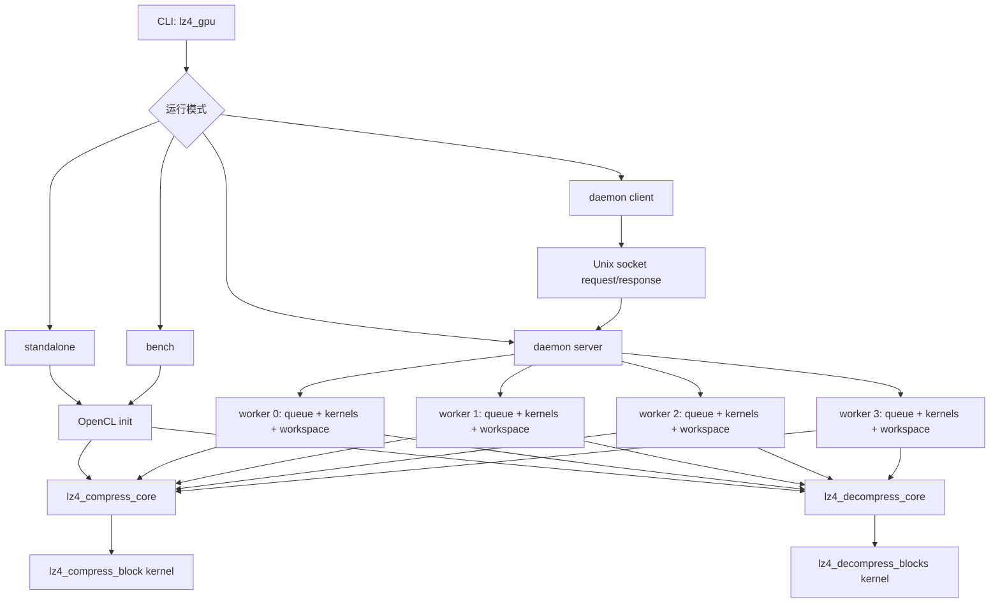

# LZ4 GPU 当前基线实现完整分析

更新时间：2026-04-19

## 分析范围与基线锚点

这份文档分析的是 `lz4_gpu` 当前用于继续优化讨论的**实现基线**，不是已经被拒绝的实验候选。

本次分析直接基于以下源码与锁定记录：

- `lz4_gpu/lz4_gpu.cl`
- `lz4_gpu/lz4_gpu.c`
- `lz4_gpu/lz4_gpu_core.c`
- `lz4_gpu/lz4_gpu_core.h`
- `lz4_gpu/lz4_gpu_daemon.c`
- `lz4_gpu/lz4_gpu_client.c`
- `lz4_gpu/lz4_gpu_protocol.h`
- `lz4_gpu/lz4_gpu_utils.c`
- `lz4_gpu/timing.h`
- `lz4_gpu/variant_validation/intel/records/kernel_comp/baseline_kcur1_kernel_comp_current.md`
- `lz4_gpu/variant_validation/intel/records/host/baseline_kcur1_host_current.md`

本次文档默认采用的基线语义是：

- 压缩内核基线：`baseline_kcur1_kernel_comp_current`
- 主机端基线：`baseline_kcur1_host_current`
- 当前核心 hash entry 设计：`12-bit epoch + 20-bit low position`
- 当前 host 主路径：`mapped` 路径保留，已退休 host 分支不作为当前基线分析对象
- 当前工作树已删除 `wi_per_cu` 作为**可配置参数**的实现痕迹；launch ceiling 仍为固定 per-CU 常量（压缩 `24`、解压 `96/48`）。

## 整体结构图



## 零、并行度模型与术语（先导）

这一节放在压缩内核之前，先把后续会反复出现的术语和并行度参数统一。

### 0.1 术语定义

- `work-item (WI)`：OpenCL 执行实体（线程粒度）。
- `raw_worker_count`：压缩并行第一层上限，来自 `min(num_blocks, max(l_ws, CU*24))`。
- `lane`：压缩调度里的活动执行通道，代码中对应 `active_lane_count`。
- `owner`：拥有私有字典切片（dict slice）的 lane。当前实现里 `owner` 与 `active lane` 一一对应。
- `dict_owner_count`：预算裁剪后的 owner 数，决定实际 hash 池体积。
- `launched work-item count`：实际 launch 的 work-item 总数，代码中对应 `launched_wi_count`（即 `g_ws`）。
- `padding_wi_count`：`launched_wi_count - active_lane_count` 的补齐 work-item 数；这些 work-item 会被 launch 但不会进入有效压缩处理。
- `blocks_per_owner`：每个 owner 预计处理的块数上界，用于 host 侧推进 `epoch_base`。
- `epoch`：12-bit 代际标签，用于判定 hash entry 是否属于当前批次。
- `tableType`：字典宽度选择，`0` 为宽表（32K 桶），`1` 为窄表（16K 桶）。
- `dict_pool_budget_bytes`：hash 池预算字节数，默认取 `global_mem/32` 并被 `[16MB, 512MB]` 裁剪。

### 0.2 block 数与 local size

$$
num\_blocks = \left\lceil \frac{file\_size}{block\_size} \right\rceil
$$

`sanitize_local_size()` 行为：
- `upper_blocks==0` 返回 `1`
- 请求为 `0`（auto）时先取 `8`
- 再由 `max_wg` 与 `upper_blocks` 裁剪
- 最终收敛为不超过上界的 2 的幂

### 0.3 压缩并行三层计划

第一层（raw ceiling）：

$$
raw\_worker\_count = \min\Big(num\_blocks,\; \max(l\_ws,\; CU\times 24)\Big)
$$

第二层（dict 预算裁剪）：

$$
dict\_owner\_count = \min\Big(raw\_worker\_count,\; \left\lfloor\frac{dict\_pool\_budget\_bytes}{dict\_bytes\_per\_owner}\right\rfloor\Big)
$$

$$
active\_lane\_count = dict\_owner\_count
$$

第三层（launch）：

$$
launched\_wi\_count = g\_ws = \text{roundUp}(active\_lane\_count, l\_ws)
$$

### 0.4 解压并行模型

- `num_blocks >= 4096`：每 CU 上限 `48`
- 其余：每 CU 上限 `96`

$$
worker\_count_{dec} = \min\Big(num\_blocks,\; \max(l\_ws,\; CU \times (num\_blocks >= 4096 ? 48 : 96))\Big)
$$

$$
g\_ws = \text{roundUp}(worker\_count_{dec}, l\_ws)
$$

### 0.5 当前口径要点

- `wi_per_cu` 已不再作为可配置参数；
- 压缩按 `raw -> owner -> active -> launch` 执行；
- 解压保持固定 per-CU ceiling 模型。

## 一、压缩内核当前实现

### 1.1 核心入口与职责

当前压缩 kernel 入口是 `lz4_compress_block`，定义在 `lz4_gpu.cl`。

它的职责非常明确：

- 每个 active work-item 拿到一个自己的 `wi` 编号；
- 从全局 `globalHashTablePool` 中切出属于这个 `wi` 的私有 hash table 片段；
- 通过 `for (b = wi; b < totalBlocks; b += total_wi)` 这种跨步方式处理多个 block；
- 每处理一个 block，调用 `lz4_compress_core_accelerated()`。

也就是说，当前压缩 kernel 的调度结构不是“一个 work-group 一个 block”，而是：

- **一个 work-item 维护一张私有字典；**
- **一个 work-item 可能处理多个 block；**
- **多个 block 是否会复用同一张字典，取决于 `num_blocks` 和 `active_lane_count` 的关系。**

### 1.2 当前 hash entry 设计

#### 1.2.1 设计动机

GPU kernel 里每个 work-item 维护一张私有字典（hash table），用于在 block 内查找历史匹配。GPU 内存模型的约束是：

- OpenCL `__global` 内存是所有 work-item 共享的大缓冲区（统一内存上共享显存）；
- 每个 work-item 通过切片（`globalHashTablePool + wi * dict_entries`）获得自己的片段；
- 因此 entry 越大，切片越大，分配给 kernel 的全局内存总量越多，进而直接影响 host 侧能同时启动的 worker 数量（owner count）。

在这个约束下，设计目标是：**在保持 entry 为 32-bit（4 bytes）的前提下，尽可能让同一张表能跨多个 block 重复使用——即"不清零复用"（steady-state reuse）**，而不是退化到"每次 block 切换都重置整张表"。

#### 1.2.2 当前设计：12-bit epoch + 20-bit low position

当前 entry 的 bit 布局如下：

```
 31      20 19              0
+----------+----------------+
|  epoch   |  position low  |
| (12 bit) |   (20 bit)     |
+----------+----------------+
```

两个核心宏的实现（`lz4_gpu.cl`）：

**写入**（`LZ4_putIndexOnHash`）：

```c
U32 packed = ((epoch & 0xFFF) << 20) | (idx & 0xFFFFF);
tableBase[h & mask] = packed;
```

- `epoch & 0xFFF`：当前 block 的 epoch 标记，12 bit 允许最多 4095 次不重置切换
- `idx & 0xFFFFF`：当前匹配候选的绝对位置的低 20 bit（最大表示 1MB 窗口内偏移）
- 写入位置：`tableBase[h & mask]`，`h` 是当前序列的 hash 值，`mask = (1 << hashLog) - 1`

**读取**（`LZ4_getIndexOnHash`）：

```c
U32 val = tableBase[h & mask];
U32 tag = val >> 20;
*entry_valid = (tag == (epoch & 0xFFF));
// 若 valid，重建 matchIndex：
U32 matchIndex = (current & ~0xFFFFF) | (val & 0xFFFFF);
// 若 matchIndex > current，说明低位发生了 wrap，回退一个周期
if (matchIndex > current) matchIndex -= 0x100000;
```

这个读取逻辑有三步：

1. **epoch tag 匹配**：先比较高 12 bit 是否等于当前 epoch，不等则认为 stale，entry 无效；
2. **位置重建**：把当前 `current` 的高位（1MB 对齐段）与 entry 的低 20 bit 拼回完整绝对位置；
3. **wrap 修正**：如果重建结果 `matchIndex > current`，说明跨越了一个 20-bit 周期，将其减去 `0x100000`（1MB）回到正确范围。

#### 1.2.3 epoch 推进机制

epoch 的推进发生在 kernel 的跨步循环里（`lz4_compress_block` 和 `lz4_compress_blocks_mapped`）：

```c
U32 epoch = epoch_base + 1U;
for (uint b = wi; b < (uint)totalBlocks; b += total_wi, ++epoch) {
    ...
    lz4_compress_core_accelerated(..., epoch);
}
```

- `epoch_base` 由 host 传入，每次文件级别的调用会累计 epoch 偏移（`ws->comp_epoch_base += blocks_per_owner + 2`），确保跨文件、跨批次的 stale entry 也能被识别；
- 每处理一个 block，epoch 自增 1；
- epoch 宽度为 12 bit（`0xFFF`），允许最多 4095 个独立 block 切换后才会 wrap（wrapping 后只要 host 合理控制 `epoch_base`，仍然安全）；
- 12-bit epoch 设计的关键收益是：**整张 hash table 在跨 block 复用时，不需要 memset 清零**——旧 entry 的 stale 状态靠 epoch mismatch 自然淘汰，读出"旧数据"时直接 skip。

#### 1.2.4 当前主线配置

当前主线配置为：

- `table_type = (block_size <= 65536) ? 0 : 1`
- `tableType==0` 时 `dict_entries = 1 << (LZ4_HASHLOG + 1) = 32768`
- `tableType==1` 时 `dict_entries = 1 << LZ4_HASHLOG = 16384`

在默认 `block_size<=64KB` 路径下，每个 owner 字典大小为 `32768 × 4 = 128KB`。

### 1.3 哈希函数与表类型

#### 1.3.1 哈希函数

当前使用的哈希函数是 Knuth 乘法 hash（`lz4_gpu.cl`，`LZ4_hash4`）：

```c
inline U32 LZ4_hash4(U32 sequence, int tableType) {
    if (tableType == 0) // byU16（宽表路径）
        return ((sequence * 2654435761U) >> ((MINMATCH*8)-(LZ4_HASHLOG+1)));
    else
        return ((sequence * 2654435761U) >> ((MINMATCH*8)-LZ4_HASHLOG));
}
```

- 乘法常数 `2654435761`（`0x9E3779B1`）是黄金分割比的 32-bit 近似，来自 Knuth 乘法 hash，具有良好的低位扩散性；
- `MINMATCH=4`，因此 `MINMATCH*8 = 32`；
- `tableType==0`（宽表）：右移 `32 - 15 = 17` 位，保留高 15 bit 作为 hash，覆盖 `2^15 = 32768` 个桶；
- `tableType==1`（窄表）：右移 `32 - 14 = 18` 位，保留高 14 bit，覆盖 `2^14 = 16384` 个桶。

这样 hash 函数输出的范围与表大小严格对应：桶地址直接就是 `h & mask`，无需二次取模。

**哈希输入** 是当前 `ip` 位置的 4 字节序列（`LZ4_read32(ip)`），通过 `LZ4_hashPosition()` 包装：

```c
inline U32 LZ4_hashPosition(const __global BYTE* p, int tableType, U32* sequence) {
    U32 s = LZ4_read32(p);
    *sequence = s;
    return LZ4_hash4(s, tableType);
}
```

- 先从 `__global` 内存读取 4 字节（一次 global memory 访问）；
- 返回 hash 值，同时通过 `*sequence` 输出原始序列（避免 candidate 确认阶段重复读取）。

这个"读+hash 合并"设计减少了 global memory 访问次数，在 GPU 上每次 global read 的延迟通常在数百 cycle，避免重复读是明确的优化动机。

#### 1.3.2 表类型选择（tableType）

当前编译时 `LZ4_HASHLOG = 14`，常量固定，不可在 runtime 通过 kernel 参数调整。

表类型（tableType）由 block size 在 **host 侧**确定，再作为 kernel 参数传入：

- `block_size <= 65536`：`tableType=0`，`hash_entries=2^15=32768`，`dict_bytes_per_owner=128KB`
- `block_size > 65536`：`tableType=1`，`hash_entries=2^14=16384`，`dict_bytes_per_owner=64KB`

当前代码默认块大小是 `32KB`（`g_cli_fixed_block_bytes=32*1024`），但无论 `32KB` 还是 `64KB` 都属于 `tableType==0` 路径，因此每个 owner 字典占用 `128KB`。

宽表路径（`tableType==0`）的设计逻辑是：

- 64KB block 内最多有 `65536` 个字节位置，如果用 16K entry 的窄表，哈希碰撞密度约为 `65536 / 16384 = 4`（平均每 4 个不同 4-byte 序列共用一个桶）；
- 宽表 32K entry 将碰撞密度降至约 2，在不改变 entry 宽度的前提下改善了命中质量；
- 这就是 R1.5 回收压缩率的核心机制：**恢复 tableType==0 宽表路径，从而让每个 owner 字典对 64K block 的有效覆盖率提高一倍**。

#### 1.3.3 全局 hash pool 预算与 owner count（当前实现）

每个 active lane（owner）的 hash table 切片来自 host 端分配的统一全局缓冲区 `globalHashTablePool`（`cl_mem`，`CL_MEM_READ_WRITE`）。

当前实现通过预算函数控制 owner 数：

在 `lz4_gpu_core.c` 中引入 `choose_comp_dict_pool_budget_bytes()` 和 `choose_comp_dict_owner_count()`：

```c
static size_t choose_comp_dict_pool_budget_bytes(cl_command_queue queue) {
    const size_t min_budget = 16MB;
    const size_t max_budget = 512MB;

    // 优先检查环境变量 LZ4_GPU_COMP_DICT_POOL_MB
    // 若未设置，则查询 GPU global_mem，取 global_mem / 32 作为预算
    size_t b = (size_t)(global_mem / 32U);
    if (b < min_budget) b = min_budget;
    if (b > max_budget) b = max_budget;
    return b;
}
```

实际分配逻辑（`lz4_build_comp_plan`）是：

```
raw_worker_count = min(num_blocks, max(local_size, cu × 24))
dict_bytes_per_owner = (tableType==0) ? 128KB : 64KB
budget = clamp(global_mem / 32, 16MB, 512MB)   // 或环境变量 LZ4_GPU_COMP_DICT_POOL_MB
budget_owners = budget / dict_bytes_per_owner
dict_owner_count = min(raw_worker_count, max(1, budget_owners))
```

其中，预算上下限来自代码常量：

- 下限：`min_budget = 16MB`
- 上限：`max_budget = 512MB`
- 默认预算：`global_mem / 32`，再被上述上下限裁剪

因此可得到当前实现的 hash 池体积边界：

$$
dict\_total\_bytes = dict\_owner\_count \times dict\_bytes\_per\_owner
$$

$$
1 \le dict\_owner\_count \le raw\_worker\_count
$$

$$
dict\_owner\_count = \min\Big(raw\_worker\_count,\; \max(1, \lfloor budget / dict\_bytes\_per\_owner \rfloor)\Big)
$$

### 1.3.3.1 分配示例（64KB 路径，`tableType=0`）

已知：
- `dict_bytes_per_owner = 128KB`
- 假设 `raw_worker_count = 768`（例如 `CU=32`、`local<=24*CU` 且 `num_blocks` 足够大）

示例 A（预算被 `global_mem/32` 算为 `75MB`）：

$$
budget\_owners = \left\lfloor 75MB / 128KB \right\rfloor = 600
$$

$$
dict\_owner\_count = \min(768, 600)=600
$$

$$
dict\_total\_bytes = 600 \times 128KB = 75MB
$$

示例 B（预算命中上限 `512MB`）：

$$
budget\_owners = \left\lfloor 512MB / 128KB \right\rfloor = 4096
$$

$$
dict\_owner\_count = \min(768, 4096)=768
$$

$$
dict\_total\_bytes = 768 \times 128KB = 96MB
$$

结论：即使预算上限是 `512MB`，实际分配仍受 `raw_worker_count` 限制，不会无限膨胀。

### 1.3.3.2 分配示例（32KB 与 64KB 的 owner 切片关系）

当 `block_size=32KB` 或 `64KB` 时，当前都走 `tableType=0`，因此：

- 每个 owner 切片仍是 `128KB`
- 区别主要在 `num_blocks`，进而影响 `raw_worker_count` 与最终 `dict_owner_count`

例如输入 `256MB`：

- `block_size=64KB`：`num_blocks=4096`
- `block_size=32KB`：`num_blocks=8192`

在同设备与同预算下，`32KB` 路径更容易把 `raw_worker_count` 顶到设备上限，从而更频繁触发预算裁剪。

关键结论：`dict_owner_count` 由 `raw_worker_count` 与 `budget_owners` 共同裁剪，最终字典体积由 owner 数决定，而不是直接由 launched WI 数决定。

### 1.4 压缩主循环逻辑

`lz4_compress_core_accelerated()` 的主体结构仍然是标准 LZ4 block compressor 的 GPU 化版本，但如果只写成“查表、命中、输出 token”，会把关键阶段讲得太粗。下面按真正执行顺序拆开。

本节关键变量对照：
- 搜索前沿：`ip / forwardIp / forwardH / searchMatchNb / step`
- 候选确认：`entry_valid / matchIndex / ipValue`
- 发射状态：`anchor / token / litLength / matchCode / op`
- 边界状态：`iend / mflimitPlusOne / matchlimit / oend`

#### 1.4.1 block 启动阶段

每个 block 开始时，kernel 会：

- 令 `ip = src`
- 令 `anchor = ip`
- 先对 block 起始位置做一次 `LZ4_hashPosition()`
- 再把位置 `0` 插入当前 WI 的私有 hash table
- 然后把 `ip` 前推一字节，准备进入 forward search

这一步的含义是：

- 当前实现不是先初始化整张表，而是靠 epoch 让旧 entry 失效；
- 当前 block 只显式插入已经走过的位置；
- 因此它本质上仍然是 LZ4 常见的“边搜索边插表”模型。

#### 1.4.2 候选（candidate）搜索阶段

候选搜索的核心变量是：

- `forwardIp`
- `forwardH`
- `searchMatchNb`
- `step`

具体过程是：

1. 用当前位置 `forwardIp` 的 4 字节序列算 hash
2. 用 `LZ4_getIndexOnHash()` 取回旧候选位置 `matchIndex`
3. 立即把当前 `current` 插回 hash table
4. 用 `step = (searchMatchNb++ >> 6)` 控制推进间隔
5. 若没命中，则继续前推 `forwardIp`

这一段可以看成“候选产生器”。它做的不是完整匹配，而只是不断地产生候选位置。

这里有两个关键观察：

- 当前候选模型只有**一个候选来源**：当前 hash bucket 的旧 entry；
- 当前没有 fingerprint，也没有第二候选桶，因此 candidate 阶段非常轻，但命中空间也比较保守。

#### 1.4.3 候选确认阶段

当前 candidate 并不会直接被当成 match，而是要过两道门：

1. `entry_valid` 必须成立，也就是 epoch tag 命中
2. `LZ4_read32(match) == ipValue` 必须成立

其中第 2 道门是当前主线唯一的内容确认门。

所以当前 kernel 的匹配确认模型可以概括为：

- epoch 负责回答“这个表项是不是当前批次还能用”
- `read32 == ipValue` 负责回答“这是不是一个真的 4-byte 候选”

#### 1.4.4 向前/向后扩展 match 阶段

一旦确认命中：

- 先通过 `while ((ip > anchor) && (match > src) && (ip[-1] == match[-1]))` 做向后回退
- 再通过 `LZ4_count(ip + MINMATCH, match + MINMATCH, matchlimit)` 做向前扩展

向后回退的意义是把 literal 尽量收短，把 match 吃满；

向前扩展的意义是尽量把当前 match 的真实长度一次性算出来。

当前 `LZ4_count()` 已经做了分级比较：

- 优先 16-byte batch compare
- 再退到 8-byte compare
- 再退到 4-byte compare
- 最后再做 2-byte / 1-byte 收尾

所以当前 match 扩展的优化重点主要落在 `count` 阶段，而不在 candidate 阶段。

#### 1.4.5 字面量（literal）阶段

当一个 match 被确认后，`anchor -> ip` 之间的区间就会变成当前 sequence 的 literal 段。

这里会先：

- 预留一个 `token = op++`
- 计算 `litLength = ip - anchor`
- 把 literal 长度的高 4 bit 写进 token 的 run-length 区
- 若 literal 长度超过 `RUN_MASK`，则继续写额外长度字节
- 然后用 `LZ4_lit_wildCopy8()` 把 literal 数据复制到输出

这一段对应 LZ4 token 格式中的“run length”部分。

#### 1.4.6 match / offset / token 阶段

在 literal 输出后，当前实现会：

- 写 2-byte offset：`LZ4_write16(op, (U16)(ip - match))`
- 再把 match length 写进 token 的低 4 bit 区域
- 若 match length 超出 `ML_MASK`，继续写额外长度字节

所以 token 在当前实现里的职责非常标准：

- 高 4 bit：literal 长度摘要
- 低 4 bit：match 长度摘要

offset 是单独跟在 token/literal 后面的 2 字节字段。

#### 1.4.7 next-match / reinsertion 阶段

当前实现并不是输出完一个 match 就彻底回到 search 起点，而是立刻做两件事情：

- 把 `ip - 2` 的位置 reinsertion 到 hash table
- 再检查 `ip` 本身是否已经构成一个新 match

如果 `ip` 当前位置直接命中，就会通过 `goto _next_match_g` 连续发出下一个 match。

这意味着当前 kernel 在 sequence emit 之后会尽量“连吃”局部高密度 match，而不是无脑重新进入长 search。

#### 1.4.8 last literals 收尾阶段

当 `forwardIp > mflimitPlusOne` 或 block 剩余空间不足以继续完整找 match 时，代码跳到 `_last_literals_g`：

- 计算剩余 `lastRun`
- 把它写入 token run-length
- 把尾部剩余数据整体复制出去

这对应 LZ4 block 结束时的标准尾字面量收尾。

#### 1.4.9 当前压缩 kernel 的阶段划分总结

如果从“后续是否要做内核阶段分离”的角度看，当前压缩 kernel 已经天然包含了这些阶段：

1. 候选产生：hash + lookup + insert
2. 候选确认：epoch 命中 + `read32` 命中
3. match 扩展：backward extend + `LZ4_count`
4. sequence emit：literal / token / offset / match length
5. tail 收尾：last literals

也就是说，当前代码虽然写在一个函数里，但逻辑上已经能拆成五段。

### 1.5 当前压缩 kernel 的优点与代价

优点：

- 路径简单；
- per-owner 私有 dict，避免跨 owner 竞争；
- epoch 方案允许同一 owner 复用 dict 槽位处理后续 block，而不必每个 block 全清表。

代价：

- `dict` 以 owner 为私有粒度，导致显著内存开销；
- 当前 `g_ws` 一旦接近 `num_blocks`，就接近“一块一表”；
- hash table 大小与 block size 的比例在 `32KB/64KB` 场景下非常不友好。

## 二、解压内核当前实现

### 2.0 术语说明（token / literal / match）

- `token`：每个 sequence 的控制字节；高 4 bit 编码 literal 长度摘要，低 4 bit 编码 match 长度摘要。
- `literal`：原样输出字节段（不通过回溯复制）。
- `match`：通过回溯复制得到的字节段，来源由 `offset` 指定。
- `offset`：`match` 回溯距离，来自输入流 2-byte 字段。
- `match length`：实际回溯复制长度，等于 token 低 4 bit 展开后再加 `MINMATCH`。
- `op_rel`：当前输出写指针的相对偏移（相对 `dst` 起点）。
- `match_rel`：match 源位置的相对偏移（`op_rel - offset`）。

### 2.1 核心入口与职责

当前解压 kernel 主入口是 `lz4_decompress_blocks`。

结构比压缩简单得多：

- 每个 WI 遍历 `idx = gid; idx < totalBlocks; idx += gsz`；
- 对每个 block 调用 `lz4_decompress_generic()`；
- 输入侧依赖 host 预先准备好的 `comp_offsets` / `comp_sizes`；
- 输出侧直接写到 `output + idx * block_size` 的固定槽位。

### 2.2 解压不使用 hash table

当前解压 kernel 完全不涉及压缩端那套 hash table / epoch / dict pool 机制。

这意味着：

- 你对 hash table 池过量的担心，主要是**压缩端问题**；
- 解压端的并行度模型仍值得重构，但它的主要矛盾不是 hash 内存，而是 launch 规模与实际 block 数的匹配、以及 host 侧 metadata 管理。

### 2.3 解压逻辑结构

`lz4_decompress_generic()` 走的是 LZ4 safe decode 的 GPU 版本，但它的内部阶段同样值得拆开。

#### 2.3.1 token 读取阶段

每个 sequence 先读一个 `token`：

- 高 4 bit 表示 literal length 摘要
- 低 4 bit 表示 match length 摘要

这一步是整个解码状态机的入口。

#### 2.3.2 literal length 展开阶段

若 token 的高 4 bit 等于 `RUN_MASK`，就需要继续从输入流里读附加长度字节，直到遇到一个非 `255` 的字节。

这一步的意义是把压缩端的“紧凑编码长度”恢复成真实的 literal 长度。

#### 2.3.3 literal copy 阶段

当前实现有两个层次：

- 快路径：当 `(length != RUN_MASK) && (ip < shortiend) && fast_output_ok && (op_rel <= fast_output_limit)` 成立时，先做 16-byte literal 复制，再走短 match 快路判断
- 慢路径：按边界检查后再做 `LZ4_lit_wildCopy8()` 或常规 copy

这意味着当前 literal 阶段的优化目标是：

- 在安全前提下尽量少做分支和边界判断
- 把常见短 literal 序列尽快搬过去

#### 2.3.4 offset 读取阶段

literal 之后会读 2-byte offset：

- `offset = LZ4_readLE16(ip)`
- `match_rel = op_rel - offset`（随后再映射到 `match` 指针）

同时会先做 `offset > op_rel` 判定，避免越界回溯。

它定义了 match 数据的来源位置。

#### 2.3.5 match length 展开阶段

token 低 4 bit 先给出 match length 摘要；

如果它等于 `ML_MASK`，就继续读附加长度字节，最后再统一加上 `MINMATCH`。

因此当前解压里的 match 长度恢复模型与压缩端完全对称。

#### 2.3.6 match copy 阶段

当前实现把 `LZ4_COPY_MATCH()` 做得比较重：

- `offset == 1 / 2 / 4` 有专门复制模式
- `offset >= len` 时可以直接按非重叠复制
- `offset >= 64 / 32 / 16 / 8 / 4` 时会用不同宽度的向量 copy

这说明当前解压 kernel 的优化重点不是 sequence 状态机本身，而是“不同 overlap 条件下如何尽量高效拷贝 match”。

#### 2.3.7 错误检测与输出阶段

当前实现对这些情况会直接走 `_output_error`：

- literal 越界
- 输入流越界
- `offset > op_rel`（等价于 `match < dst`）
- 输出越界

错误时会把 `outputSizePtr` 写成 `0xFFFFFFFF`，由 host 侧把它当成解压失败。

#### 2.3.8 当前解压 kernel 的阶段划分总结

如果按阶段来理解，当前解压 kernel 至少能拆成：

1. token 读取
2. literal length 展开
3. literal copy
4. offset 读取
5. match length 展开
6. match copy
7. 边界/错误处理

这套阶段划分已经足够支持后续“内核内各阶段分离”的设计讨论。

### 2.4 解压 kernel 的并行度性质

解压端每个 work-item 不需要持有私有大字典，因此：

- `g_ws` 调大带来的主要代价是 launch 与空转，不是大块 `dict` 内存；
- 这也是为什么“work-item 数量是否过量”在解压侧是一个**吞吐/调度问题**，而不是一个**巨大显存膨胀问题**。

## 三、主机端当前实现

### 3.0 术语与参数说明

- `queue`：OpenCL 命令队列，负责提交 `write/read/kernel` 操作并承载 profiling 时间戳。
- `workspace`：一次或多次任务复用的设备缓冲集合（如 `in_buf/out_buf/output_size_buf/dict_buf` 等）。
- `local_size`（`l_ws`）：work-group 局部尺寸，先经 `sanitize_local_size()` 清洗后参与 launch。
- `g_ws`：kernel 的 global size；压缩侧来自 `lz4_build_comp_plan()`，解压侧来自 `worker_count` round-up。
- `block_size`：分块大小，影响 `num_blocks`、`tableType` 与字典体积。
- `mapped/standard copy`：host-device 传输两种路径，默认按统一内存设备能力自动选择。

## 3.1 CLI 与运行模式

`lz4_gpu.c` 同时承载了四条运行路径：

- `standalone`
- `bench`
- `daemon server`
- `daemon client`

当前实现中，`g_cli_fixed_block_bytes` 默认值已与 `show_help()` 对齐为 `64KB`。

这意味着默认运行口径与文档口径一致，避免了块数与 hash 池体积的误判。

## 3.2 OpenCL 初始化

`ocl_init()` 做的事情是：

- 根据 `FORCE_OPENCL_DEVICE` 选择 device type 偏好；
- 枚举 platform；
- 尝试 `GPU -> DEFAULT -> ALL -> CPU` 或其他对应顺序；
- 创建一个 `context`；
- 创建一个 profiling-enabled 的 `queue`。

standalone / bench 使用的是这条路径。

### 3.3 Program 加载

standalone / bench 路径调用 `lz4_load_program()`：

- 优先查找 `lz4_gpu_14.clbin`
- 若可用则 `clCreateProgramWithBinary`
- 否则 fallback 到 `lz4_gpu.cl` 源码编译

注意点：

- 当前 runtime 固定 `hash_log = 14`
- 真正决定表容量的是 `hash_log + tableType` 的组合，而不是重新换一套 runtime clbin
- 当前路径会验证 binary 中至少能创建 `lz4_compress_block` 与 `lz4_decompress_blocks`

### 3.4 压缩 host 核心路径

`lz4_compress_core()` 是当前 host 压缩主流程的中心。

它的主要步骤如下：

1. `stat` 输入文件，得到 `file_size`
2. 计算 `num_blocks = ceil(file_size / block_size)`
3. 根据 `local_size` 调 `sanitize_local_size()` 得到 `l_ws`
4. 调 `lz4_build_comp_plan()` 计算压缩计划：`raw_worker_count -> dict_owner_count -> active_lane_count -> launched_wi_count`
5. 取 `g_ws = launched_wi_count`（其定义等价于 `round_up(active_lane_count, l_ws)`）
6. 分配并上传 `in_buf`
7. 分配 `out_buf`
8. 分配 `output_size_buf`
9. 分配 `dict_buf`
10. 处理 `comp_epoch_base` 与 wrap 清零
11. 设置 kernel args
12. `clEnqueueNDRangeKernel`
13. 回读每个 block 的压缩输出大小
14. 按固定 `single_block_max_out` 步长，从稀疏输出槽位打包写成 `.lz4` 文件

### 3.5 解压 host 核心路径

`lz4_decompress_core()` 的主要步骤如下：

1. 读 `.lz4` 头部：magic、`num_blocks`、`block_size`
2. 读每块的压缩大小数组
3. 在 host 上构造 `comp_offsets`、`out_offsets`、`max_out_sizes`
4. 分配 / 复用 `in_buf`、`out_buf`
5. 上传压缩数据
6. 分配 / 复用 `decomp_comp_off_buf`、`decomp_comp_size_buf`、`decomp_sizes_out_buf`
7. 上传 metadata
8. 设置解压 kernel args
9. 启动 `lz4_decompress_blocks`
10. 回读 `sizes_out`
11. 按 `total_decomp_sz` 写最终输出文件

### 3.6 映射拷贝与标准拷贝

当前 host 路径有两种 host-device I/O 模式：

- `clEnqueueRead/WriteBuffer` 标准拷贝
- `map/unmap` 模式

选择逻辑是：

- 若显式设置 `LZ4_STANDARD_COPY=0/1`，按环境变量走；
- 否则，根据 `CL_DEVICE_HOST_UNIFIED_MEMORY` 自动判断；
- unified memory 倾向 map/unmap，否则倾向标准 copy。

当前 host baseline 的 `mapped` 路径保留，是当前主路径的一部分。

## 四、bench、standalone、daemon 三条 host 路径的差异

### 4.1 standalone

standalone 的特点是：

- 每次进程启动时完成 `OpenCL init + program load + kernel create`
- 一次压缩或解压完成后退出
- 单个 `queue`
- 单个 `workspace`

所以 standalone 更接近“单次真实作业成本”。

### 4.2 bench

bench 并不是简单重复调用 standalone，而是一个**特殊的复用路径**。

关键差异：

- `OpenCL context / queue / program / kernel / workspace` 只建一次
- 第一次压缩后，后续轮次通过 `input_uploaded_once` 触发 `skip_input_upload`
- bench 内部自己做解压验证（直接调解压 kernel 路径）
- 解压 metadata 缓冲会跨轮复用
- 通过 `prev_meta_valid + memcmp` 判定 metadata 是否变化，未变化时跳过重复上传
- 支持 warmup 轮（`LZ4_GPU_BENCH_WARMUP_ROUNDS`）后再计时

这意味着：

- bench 的 timing 不是 standalone latency 的直接复制品；
- 它更接近“稳态复用后的吞吐”；
- 对 host 缓冲复用优化特别敏感。

### 4.3 daemon server

`lz4_gpu_daemon.c` 这条路径是另一套完全不同的 host 组织方式。

当前 daemon 的结构是：

- 一个全局 `context`
- **自适应 worker 数**（上限 `MAX_WORKERS_CAP=16`）：
  - 优先读取环境变量 `LZ4_DAEMON_WORKERS`（取值钳入 `[1, MAX_WORKERS_CAP]`）
  - 否则取 `min(cpu_online/2, ceil(CU/8))`；Intel Iris Xe（32CU）下典型为 `3`
- 每个 worker 独立持有：
  - 一个 `queue`（无 profiling，daemon 不上报 `ocl_setup_us`）
  - 一组 `kernel` 指针（共享 `program_comp`，惰性编译，加锁保护）
  - 一个 `lz4_gpu_workspace_t`
  - 一条 pthread worker 线程
- client 通过 Unix socket 发请求
- server 把请求分配给第一个空闲 worker（trylock 轮询，1ms 间隔）
- worker 在线程内直接调用 `lz4_compress_core()` 或 `lz4_decompress_core()`

kernel 路径查找顺序（`resolve_daemon_file`）：

1. 环境变量 `LZ4_GPU_DAEMON_CLBIN` / `LZ4_GPU_DAEMON_CL`
2. 进程当前目录
3. 可执行文件所在目录
4. 可执行文件目录的 `../lz4_gpu/` 子路径
5. 按文件名直接 access

这里有三个重要的实现结论：

第一，daemon 的 workspace 是**按 worker 分裂**的，不是共享一套。

第二，daemon 的总 GPU 缓冲占用在多请求并发时会按活跃 worker 数放大。

第三，daemon 当前不是“真正的流式数据服务”，而是“路径请求转发器”：

- client 只传 `input_path` / `output_path`
- server 仍然自己读文件、写文件
- socket 只传控制消息和 timing，不传 payload。

### 4.4 daemon client

`lz4_gpu_client.c` 做的事情很简单：

- 检查 socket 是否存在
- 连接 daemon
- 把 `mode / block_size / acceleration / local_size / input_path / output_path` 组织成 `request_t`
- 收 `response_t`
- 打印统计

它不参与 OpenCL，也不做真正的数据搬运。

## 五、当前基线风险点（仅保留与主线实现直接相关项）

1. daemon 目前无负载感知调度，仅"first idle worker"轮询分配，无请求大小亲和性。
2. daemon 每个 worker workspace 大小固定，暂不随请求 block_size 动态收缩。

## 六、本文件结论

本文件仅锚定当前已采纳并在主线生效的实现：

- 压缩内核：R1.5（预算分片 + 宽哈希恢复）
- 解压内核：M3（relative-offset + <=18B fast-direct）
- 主机端：mapped 主路径

其余未采纳候选、历史草案与迁移提案，均不纳入本文件。
