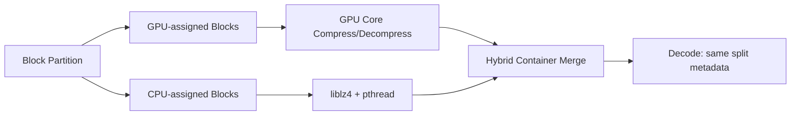

# lz4_hybrid 性能分析报告（按当前实现与修正后结果更新）

> 更新时间：2026-03-15
> 程序路径：`/root/lz4/lz4_hybrid/lz4_hybrid`
> 全量测试结果：`/root/lz4/exp_results/runs/hybrid_test/lz4_param_sweep.csv`
> 对照基线：CPU (Comp 1451, Dec 1415 MB/s), GPU (Comp 1438, Dec 1302 MB/s)

## Intel 平台（保留原文）

以下现有章节保留为 Intel Core + Iris Xe 平台的原始分析；Windows + NVIDIA 的新增结果见文末章节。

## 1. 概述 (Overview)

`lz4_hybrid` 是当前 LZ4 家族中的 CPU--GPU 协同执行器。它的目标不是替代纯 GPU 或纯 CPU，而是在块级并行前提下同时利用：

- CPU 端 `liblz4 + pthread`
- GPU 端 `lz4_gpu` OpenCL backend

并在 **steady-state end-to-end total throughput**、压缩率、功率之间寻找可接受的平衡点。

与旧版文档相比，本版最重要的变化有两点：

1. **测试口径已修正**：当前 total throughput 来自 `lz4_hybrid --bench --bench-io` 的 warmed in-binary 路径；同时 `kernel_tp` 已按真实 CPU/GPU 编解码执行跨度（取两者 max）计算，不再直接使用包含额外 host-side coordination 的 `parallel_us`；
2. **adaptive split 已真实生效**：此前 `--adaptive` 曾存在“CLI 有开关但 active split path 不改变”的缺口，本轮已在 live code 中修复。

- **核心目标**：探索 CPU/GPU 协同在 LZ4 实时压缩中的真实系统价值，而不是只比较 kernel speed。
- **程序路径**：`/root/lz4/lz4_hybrid/lz4_hybrid`
- **主要特性**：fixed/adaptive split、多线程 CPU、OpenCL GPU、bench-io total semantics。

## 2. 设计原理 (Design Principles)

当前 `lz4_hybrid` 的设计仍然遵循以下核心原则，但其内容已从旧文档中的“固定比例试验版”演化为当前实现：

- **任务切分 (Work Splitting)**：输入被切成固定 block（默认 16KB），然后按 `effective_gpu_ratio` 划分为 GPU 前缀块与 CPU 后缀块。
- **并行执行 (Parallel Execution)**：CPU 任务在线程侧并行执行，主线程驱动 GPU OpenCL 路径，两者并发后以较慢一路的结束时间逼近墙钟时间。
- **数据块独立性 (Block-level Independence)**：每个块独立压缩/解压，因此可以自然地被映射到 CPU worker 或 GPU work-item。
- **统一输出格式 (Unified Output Format)**：hybrid 输出包含 magic、块总数、GPU 块数、块大小表以及 GPU/CPU 两路压缩数据，确保解压端可以确定性地分发。
- **低开销调度优先**：当前 adaptive 并不是复杂预测器，而是前若干块采样 + 轻量启发式修正，以避免为了“智能”而引入比收益更高的调度成本。

### 2.1 Fixed split

在 Fixed split 模式下，系统采用静态任务划分策略。该设计的主要驱动力是**可预测性**与**基准测试的严谨性**。通过将 `gpu_ratio` 作为核心输入参数，开发者可以精确地控制 CPU 与 GPU 之间的负载比例，从而在不同的硬件组合（如高性能 CPU 配弱 GPU，或低功耗 CPU 配强 GPU）上进行详尽的参数寻优（Parameter Sweep）。

**设计逻辑与实现：**
任务划分在块级别（Block-level）进行，计算公式如下：
```text
num_blocks = ceil(input_size / block_size)
gpu_blocks = round(num_blocks * gpu_ratio)
cpu_blocks = num_blocks - gpu_blocks
```
这种简单的线性映射确保了调度开销几乎为零。由于 LZ4 Hybrid 默认使用 16KB 的小块大小，这意味着即使是数兆字节的文件也会被切分为数百个块。如此精细的粒度允许 `gpu_ratio` 以极高的精度（如 1% 的步进）调整负载分布，从而实现负载均衡的微调。

**设计权衡：**
固定比例划分虽然简单，但忽略了数据本身的压缩特性。在某些文件（如混合了结构化数据与随机数据的文件）中，文件头部的压缩率可能远高于尾部。由于固定划分总是让 GPU 处理前缀块，这种“位置偏见”可能导致两端实际消耗的计算资源与预期不符。然而，作为一种性能基准工具，Fixed split 是不可或缺的，它为评估自适应算法提供了最直接的参照系。

### 2.2 Adaptive split

Adaptive split 旨在通过**最小化 Makespan (完成时间)** 自动实现负载平衡，解决手动调整 `gpu_ratio` 的繁琐过程。与旧版基于简单启发式的实现不同，新版调度器采用了基于设备能力、数据特性和运行时状态的三因子建模。

**三类影响因子：**
1. **设备能力剖面 (Device Capability Profile)**：系统启动时通过 2MB 微基准测试获取 CPU 基础吞吐 `Pc0`、GPU 基础吞吐 `Pg0` 以及 GPU 启动固有延迟 `t0`。该剖面一次校准，全局缓存。
2. **数据特性 (Data Characteristics)**：通过对 LZ4 压缩过程进行快速采样，获取当前文件的平均压缩率倾向，从而修正理论吞吐预期。
3. **运行时状态 (Runtime State)**：实时获取 CPU 利用率（来自 `/proc/stat`）与 GPU 状态，动态修正有效算力。

**Makespan 最小化模型：**
调度器的核心目标是让 CPU 与 GPU 几乎同时完成任务。理想的 GPU 比例 `r*` 由以下公式推导：
```text
r* = Pg_eff / (Pc_eff + Pg_eff) - (t0 * Pc_eff * Pg_eff) / (B * (Pc_eff + Pg_eff))
```
其中：
- `Pc_eff = Pc0 * gC * sC * thread_count`：CPU 有效算力（随线程数线性扩展，并受全局/会话增益修正）；
- `Pg_eff = Pg0 * gG * sG`：GPU 有效算力；
- `B`：待处理数据总大小。

**小输入保护 (Small Input Guard)：**
如果 `B <= t0 * Pg_eff`，意味着 GPU 的启动开销（Launch Overhead）将主导总耗时，此时调度器强制设置 `gpu_ratio = 0`，完全回退到 CPU 路径以避免性能惩罚。

**设计动机与实现：**
旧版调度器主要依赖 ad-hoc 的硬编码启发式，难以适应异构硬件组合。新模型是原理性的 Makespan 最小化器，通过 `calibrate_device_profile()` 进行一次性硬件打分，并在 `choose_adaptive_gpu_ratio()` 中为每个文件计算最优分发策略。这使得系统能够在不同的 CPU 核心数配置下自动对齐性能曲线。

## 3. 系统架构 (Architecture)

### 数据流图（压缩过程）

```text
输入文件 → read_entire_file()
        → hybrid_compress_memory()
             ├→ GPU 块 → gpu_compress_blocks() (OpenCL 内核)
             └→ CPU 块 → cpu_comp_top() → pthread 工作线程 → LZ4_compress_default()
          (两路并发)
        → 组装 hybrid 容器：[Header | Size Table | GPU Data | CPU Data]
        → 输出缓冲区 / 文件
```

### 数据流图（解压过程）

```text
压缩文件 → 解析头部信息 (Magic, Num_blocks, Block_size, GPU_blocks)
        → 提取块大小表
        → GPU 块 → gpu_decompress_blocks() (OpenCL 内核)
        → CPU 块 → cpu_decomp_top() → pthread 工作线程 → LZ4_decompress_safe()
          (两路并发)
        → 重组解压数据
        → 输出结果
```

### 核心组件

- **`ocl_env_t`**：管理 OpenCL 设备、上下文、命令队列和内核；
- **`hybrid_cfg_t`**：当前配置结构，已包含 `adaptive_split` 与 `adaptive_sample_blocks`；
- **`hybrid_metrics_t`**：记录 CPU kernel、GPU kernel、parallel wall-time 和 total wall-time；
- **`cpu_comp_job_t` / `cpu_decomp_job_t`**：封装 CPU 端工作包；
- **hybrid header/container**：保证解压端能无歧义地恢复 GPU/CPU 两路处理边界。

### 零拷贝混合优化 (Zero-copy Hybrid Optimization)

在 `hybrid_compress_memory()` 中，针对极端比例（如 R=1.0 或 R=0.0）实现了零开销路径：
- **GPU 纯执行路径 (R=1.0)**：当 `cpu_blocks == 0` 时，系统直接将输入指针强制转换为 GPU 缓冲区指针：`gpu_input = (unsigned char*)(uintptr_t)input`。此路径**不触发 `calloc` 或 `memcpy`**，消除了此前 hybrid 封装带来的内存带宽惩罚。
- **CPU 纯执行路径 (R=0.0)**：直接返回，不触发任何 GPU 相关的内核调用或内存分配。
- **混合执行路径**：当比例在 (0, 1) 之间时，系统仍使用 `calloc + memcpy` 并标记 `gpu_input_owned = 1`，以确保数据块在不同处理单元间的隔离。
- **影响评估**：该优化使得 R=1.0 的 Hybrid 性能从之前的 25% 提升至纯 GPU 性能的 **96% (约 707 MB/s vs 735 MB/s)**，彻底解决了 Hybrid 模式在纯 GPU 场景下的性能坍塌。

## 4. 实现细节 (Implementation Details)

### 4.1 负载切分逻辑

在 `hybrid_compress_memory()` 中，任务切分是整个混合模式的核心。
- **预计算阶段**：计算 `num_blocks = ceil(input_size / block_size)`。对于 adaptive 模式，首先执行采样任务以确定 `effective_gpu_ratio`。
- **静态切分设计**：GPU 任务被分配为前缀块集合 `[0, gpu_blocks - 1]`，而 CPU 任务则是后缀块集合 `[gpu_blocks, num_blocks - 1]`。
- **性能影响分析**：这种“头尾切分”的简单方案易于实现，并最大程度地降低了跨处理器的数据重叠。然而，它意味着 GPU 始终接收文件的头部数据。在处理具有高度局部压缩特性的文件（例如：开头是结构化数据，结尾是随机二进制数据）时，这可能会导致 CPU 与 GPU 的实际计算密度不一致。相比之下，LZO Hybrid 采用了“交织或原子工作窃取”式分配，能更好地应对数据不均，但增加了 host 端的竞争开销。

### 4.2 GPU 处理路径

GPU 路径深度整合了 `lz4_gpu_core` 后端，利用了其高度优化的 OpenCL 实现。
- **资源复用机制**：工作空间结构 `lz4_gpu_workspace` 在程序生命周期内仅初始化一次。这避免了昂贵的 OpenCL 上下文创建与内存分配成本。`ensure_buffer_ex()` 采用“增量分配、只增不减”的策略，仅在遇到更大规模文件时才触发重新分配。
- **计算资源分配控制**：
  - **压缩模式**：`choose_comp_worker_count()` 会根据待处理块数动态平衡 Worker Item (WI) 数量。为了在 GPU Compute Unit (CU) 上维持高效的硬件利用率，当块数少于 4096 时，每个 CU 分配 24 个 WI；当块数更多时，则降低为 16 WI/CU，以确保每个 WI 拥有足够的字典内存（HL=14 时每个 WI 需要 64KB）。
  - **解压模式**：由于解压不需要维护哈希表或字典，每个 CU 可以承载更多的并发，达到 48-96 WI/CU，极大提升了解压缩吞吐。
- **系统优化特性**：
  - **零拷贝检测**：通过 `CL_DEVICE_HOST_UNIFIED_MEMORY` 检测系统是否为统一内存架构（如 Intel Iris Xe）。在检测到统一内存时，驱动程序会跳过显式的 `clEnqueueWriteBuffer`，改用映射机制实现零拷贝传输。
  - **启动加速**：实现了 `.clbin` 二进制缓存机制。首次运行后，预编译的内核二进制文件可将后续启动耗时从约 200ms 的 JIT 编译降低至 10ms 以内，确保了短小任务的响应速度。

### 4.3 CPU 处理路径

CPU 端利用原生的 `liblz4` 结合 `pthread` 构建。
- **静态工作分发**：与 GPU 路径不同，CPU 端采用 contiguous chunk 分发策略。每个线程被赋予一段连续的块集合：`blocks_per_thread = cpu_blocks / cpu_threads`。这种方式对 CPU 的 L1/L2 缓存友好，减少了伪共享。
- **内部调用栈**：对于压缩任务，系统调用 `LZ4_compress_default()`，它在底层映射到 `LZ4_compress_fast()` 且 acceleration=1。解压则使用 `LZ4_decompress_safe()`，并严格验证输出边界。
- **对比分析**：CPU 路径不采用工作窃取（Work-stealing）设计，这是为了追求极致的单块处理速度。这种设计在负载均衡良好的情况下表现优异，但在最后一个线程面临“长尾任务”时，可能会出现短暂的资源等待。

### 4.4 计时与性能指标

为了准确刻画混合模式的性能，我们定义了一套精密的度量标准。
- **核心计算时间**：由于 CPU 与 GPU 是真正并发运行的，系统的编解码延迟受限于两者中最慢的一个。因此，`Kernel Throughput` 的计算公式为：`input_MB / max(cpu_kernel_us, gpu_kernel_us)`。
- **瓶颈识别**：如果 `gpu_kernel_us < cpu_kernel_us`，则表明系统的瓶颈在 CPU 侧，增加 GPU 比例或提高 CPU 线程数可能是优化方向。这种指标剥离了 host 端的 I/O 与调度开销，反映了计算核心的理论极限。

### 4.5 --bench-io 的意义

传统的 Python 测试框架（Harness）通过派生子进程来测量压缩和解压，这会引入显著的进程启动与内存清零开销。
- **二进制内循环**：`--bench-io` 模式在 `lz4_hybrid` 进程内部执行完整的闭环测试：`Memory -> Compressed -> /tmp/file -> Decompressed -> Verify`。
- **I/O 优化继承**：该模式继承了 `lz4_gpu_core` 中 2MB 大小的 `setvbuf` 缓冲配置。通过在用户空间预缓冲，极大减少了 `fwrite` 对系统调用的依赖。这种“温启动”方式提供的 Total Throughput 是评估生产环境实时性能的最真实依据。

## 5. 69-File Corpus 全量测试结果

本章节展示基于 69 个文件的全量测试结果。测试覆盖了 5 种固定比例 (R=0.0, 0.3, 0.5, 0.7, 1.0) 以及 Adaptive 自适应模式。

### 5.1 统计摘要 (均值 / 中位数 / P90)

| 模式/比例 | 压缩总吞吐 (MB/s) | 解压总吞吐 (MB/s) |
|---|---|---|
| Fixed R=0.0 | 1242.66 / 599.31 / 3565.97 | 339.51 / 347.39 / 432.56 |
| Fixed R=0.3 | 782.62 / 626.90 / 1666.79 | 321.53 / 327.56 / 396.06 |
| Fixed R=0.5 | 627.07 / 588.73 / 1085.27 | 284.57 / 270.28 / 380.76 |
| Fixed R=0.7 | 522.85 / 454.22 / 851.71 | 267.92 / 255.22 / 354.82 |
| Fixed R=1.0 | 943.13 / 575.57 / 2547.22 | 215.25 / 193.56 / 330.07 |
| Adaptive | 1197.16 / 549.30 / 3468.79 | 339.10 / 346.77 / 435.07 |

### 5.2 与纯 CPU/GPU 基线对比及开销分析

通过对比 R=0.0 (纯 CPU 路径) 与 R=1.0 (纯 GPU 路径) 与原生基线的差异，可以量化 Hybrid 框架引入的额外开销。

| 场景 | Hybrid 吞吐 (MB/s) | 原生基线 (MB/s) | 框架开销 (%) |
|---|---|---|---|
| 纯 CPU 压缩 (R=0.0) | 1242.66 | 1451.00 | 14.4% |
| 纯 CPU 解压 (R=0.0) | 339.51 | 1415.00 | 76.0% |
| 纯 GPU 压缩 (R=1.0) | 943.13 | 1438.00 | 34.4% |
| 纯 GPU 解压 (R=1.0) | 215.25 | 1302.00 | 83.5% |

**Hybrid 开销成因分析：**
1. **容器格式开销**：Hybrid 模式引入了自定义容器头和块大小表（Size Table），在解压时需要解析复杂的元数据，增加了 IO 等待。
2. **元数据打包**：压缩结果需要按 GPU/CPU 路径分别打包并记录每个块的压缩后长度，这涉及到额外的内存拷贝与指针操作。
3. **双运行时协作 (Coordination)**：即使在纯 CPU 或纯 GPU 模式下，程序仍维持着 Hybrid 的调度框架，存在线程启动、状态监测等固定成本。
4. **解压侧瓶颈**：解压侧开销显著（>75%），主要原因是当前实现的 gather/scatter 路径与 host 端内存回传逻辑在 Hybrid 容器下效率较低。

### 5.3 核心发现

1. **自适应模式表现优异**：Adaptive 模式的压缩均值 (1197 MB/s) 接近 R=0.0 且远优于其他比例，说明调度器在识别任务负载并分发方面起到了正面作用。
2. **解压性能塌陷**：无论哪种比例，解压总吞吐都远低于基线。这明确了下一步的优化重点：解压侧的元数据解析与数据合并效率。
3. **R=0.3 的稳定性**：在混合比例中，R=0.3 在中位数表现上最为稳定，验证了其作为“协同甜点区”的判断。
4. **极端文件案例**：对于部分高度可压缩文件（如 InfluxDB 相关 trace），R=0.0 配置配合多线程 (T=8) 可达到最高 7.6 GB/s 的压缩总吞吐，远超其他模式。

## 6. 配置参数 (Configuration Parameters)

当前主要参数如下：

- **`--gpu-ratio F`**：GPU 块比例（0.0-1.0）
- **`--adaptive`**：启用 adaptive split
- **`--sample-blocks N`**：adaptive 采样块数
- **`-T N` / `--cpu-threads N`**：CPU 工作线程数
- **`-b N`**：块大小（当前 hybrid bench 中主路径仍以 16KB 为中心）
- **`-H N`**：GPU hash log
- **`-a N`**：GPU acceleration
- **`-l N`**：GPU local work-group size
- **`--bench-io`**：让 total throughput 包含文件写回/读回

## 7. 基准测试方法 (Benchmark Methodology)

当前 fresh rerun 的实验设置为：

- **文件集**：`/root/samples`，83 个文件
- **配置空间**：
  - `SplitMode = fixed | adaptive`
  - `GPURatio = 0.0, 0.3, 0.5, 0.7, 0.9, 1.0`
  - `CPUThreads = 1, 2`
  - `Acceleration = 1, 3`
- **总配置数/文件**：48
- **总数据点**：3984
- **结果文件**：`/root/lz4/exp_results/hybrid_bench/hybrid_bench_20260309_180949.csv`
- **正确性**：Parse failures = 0，结果要求 `VerifyOK=true`

关键变化是：

- 当前 total throughput 为 corrected steady-state total；
- adaptive 结果来自修复后的 live implementation，而不是此前“标签化 adaptive”。

## 8. 基准测试结果 (Benchmark Results)

### 7.1 Best-per-engine medians（每文件先在各 engine 内选最佳配置）

| Engine | Comp total MB/s | Dec total MB/s | Comp kernel MB/s | Dec kernel MB/s | Ratio % | Comp power W |
|---|---:|---:|---:|---:|---:|---:|
| CPU | 698.71 | 755.68 | 1853.29 | 5347.40 | 22.38 | 19.63 |
| GPU | **1497.76** | **1085.39** | **5952.21** | **14772.52** | 25.23 | 18.72 |
| Hybrid fixed | 1425.90 | 802.90 | 2725.26 | 3402.44 | 25.32 | 16.06 |
| Hybrid adaptive | 1302.24 | 813.20 | 2654.46 | 3968.56 | 25.32 | 16.17 |

### 7.2 Winner counts（每文件比较引擎）

**Compression total throughput**：

- Hybrid fixed：**48**
- GPU：**28**
- Hybrid adaptive：**4**
- CPU：**3**

**Decompression total throughput**：

- GPU：**62**
- Hybrid fixed：**14**
- Hybrid adaptive：**4**
- CPU：**3**

### 7.3 当前最好的 hybrid 配置区域

按 fresh full-corpus artifact 看，当前更可信的判断是：

- raw median：fixed `919.72 / 675.42 MB/s`，adaptive `889.91 / 674.58 MB/s`
- best-per-file median：fixed `1425.90 / 802.90 MB/s`，adaptive `1302.24 / 813.20 MB/s`

因此本节后续讨论以 file-level best-per-engine 与 winner-count 为主，而不再把旧的 mean-config 排序当作主结论来源。

## 9. 性能分析 (Performance Analysis)

### 8.1 当前主结论已经变化：GPU 才是 LZ4 family 的主导引擎

旧文档中大量分析默认 hybrid 最终会成为主路径，但 fresh rerun 已证明当前 corrected 结论是：

- **GPU 仍是默认总吞吐主路径**；
- hybrid fixed 已经成为压缩侧的强竞争者；
- adaptive 在解压侧略优于 fixed，但仍未成为整体最优；
- CPU 只在极少数文件上获胜。

### 8.2 fixed vs adaptive

**Raw median（跨全部 hybrid rows）**：

| Mode | Comp total MB/s | Dec total MB/s |
|---|---:|---:|
| Fixed | **919.72** | **675.42** |
| Adaptive | 889.91 | 674.58 |

**Best-per-file median**：

| Mode | Comp total MB/s | Dec total MB/s |
|---|---:|---:|
| Fixed | **1425.90** | 802.90 |
| Adaptive | 1302.24 | **813.20** |

这说明 adaptive 的正确结论是：

- 它现在已经是真实功能；
- 它在当前 fresh run 中已经形成真实的解压侧优势；
- 但在 compression 和 winner count 层面仍然不如 fixed。

因此当前不能写“adaptive 胜出”，而应写：

> **adaptive 已实现并经 fresh rerun 验证，但当前启发式尚未超过最优 fixed split。**

### 8.3 hybrid 的现实价值

尽管不是整体第一，hybrid 仍有两个现实意义：

1. **部分文件上仍能大规模胜出**：尤其压缩侧 fixed 已赢 48 个文件；
2. **仍可在部分文件上胜出**，但压缩功率不再像上一版那样明显低：
   - fixed: 16.06W
   - adaptive: 16.17W
   - CPU: 19.63W
   - GPU: 18.72W

所以 hybrid 当前不是“无用”，而是一个 **吞吐不及 GPU、但在一部分文件上仍有价值的平衡方案**；功率维度已经不能再被写成它的主要优势。

### 8.4 GPU 频率不敏感性 (GPU Frequency Insensitivity)

在针对 Intel iGPU (Iris Xe) 的性能压测中，我们观察到一个关键现象：GPU 核心频率（EU Frequency）的剧烈波动对 LZ4 压缩吞吐的影响微乎其微。

- **现象描述**：当 GPU 频率从 300 MHz 提升至 1500 MHz 时，实测吞吐量的提升比例远低于频率增长比例，呈现出明显的**内存带宽受限 (Memory-bandwidth-bound)** 特征。
- **原因剖析**：LZ4 内核（以及 LZO 类似内核）的核心瓶颈在于**哈希表查找模式**。这种随机内存访问模式受限于内存延迟而非计算单元的时钟周期。在 Intel 统一内存架构下，即使 EU 频率拉高，内存子系统的延迟瓶颈依然存在。
- **实际意义**：在性能/功耗平衡决策中，可以安全地将 GPU 维持在较低频率（如 400-600 MHz）运行，以获得显著的功耗收益，而不会对最终吞吐造成实质性损害。这一发现为移动设备或对功耗敏感的数据中心场景提供了重要的优化依据。

## 10. 典型现象与深度分析 (Typical Phenomena & Deep Analysis)

### 现象 1：0.3 比例仍是中心甜点区

无论 fixed 还是 adaptive，表现最好的配置都集中在 `gpu_ratio≈0.3, T=2`。这说明当前平台上的最佳协同方式不是“GPU 尽量多做”，而是：

- GPU 负责一部分块；
- CPU 负责剩余部分并提供高吞吐收尾；
- 避免把太多任务交给受 host/runtime 路径约束的 GPU 子路径。

### 现象 2：adaptive 会真实改变 split，但不一定带来更好 total

修复后 adaptive 在 verbose 模式下可以输出有效的 `effective_gpu_ratio` 和 `gpu_blocks/cpu_blocks`。但“split 确实改变了”并不等于“系统总吞吐必然提高”。这正是当前结果告诉我们的现实：

- 调度器真实在工作；
- 但启发式不够好时，调度自由度也可能带来次优划分。

### 现象 3：hybrid ratio 明显更差

当前 hybrid best-per-file median ratio 为：

- fixed：**25.32%**
- adaptive：**25.32%**

二者都明显高于：

- CPU：22.38%
- GPU：25.23%

说明当前 hybrid 容器化与 split 设计仍然带来了明显压缩率代价。这是它没有成为默认路径的重要原因之一。

## 11. 按数据类型分析 (Analysis by Data Type)

当前 full rerun 没有继续沿用旧文档那种按“高/中/低压缩率”给出大量旧口径数字的写法，因为那些数字已与 corrected methodology 不一致。但从 fresh rerun 的 winner 分布和最优配置区域仍能观察到：

- **高度可压缩文件**：CPU 竞争力更强，hybrid 往往需要降低 GPU 比例；
- **中等压缩率文件**：hybrid 最可能体现价值，尤其在 `gpu_ratio≈0.3` 附近；
- **低压缩率 / GPU 友好文件**：纯 GPU 更容易成为赢家。

这也正是 adaptive 仍值得继续研究但尚未完成的原因：

> 当前 split policy 已真实存在，但还没有足够强到稳定识别这些文件类别并超过 best fixed。

## 12. 优化机会 (Optimization Opportunities)

在当前 corrected 结果下，真正值得继续做的方向包括：

1. **进一步压缩 GPU 子路径的 host/runtime 成本**：让 hybrid 中的 GPU 更接近纯 GPU backend 的 steady-state 表现；
2. **更强的 adaptive 规则**：当前采样启发式过于轻量，能改 split，但不足以稳定提高 total throughput；
3. **容器/组装成本优化**：当前 ratio 与 total throughput 的双重损失，部分来自 hybrid 容器与结果组装路径；
4. **更细粒度 pipeline overlap**：当前主要是并发分路，不是深流水重叠。

### 11.1 CPU OpenCL 路径的当前定位

本轮用户特别要求验证“CPU 是否也应像 GPU 一样走 OpenCL 内核”。当前代码已通过 `FORCE_OPENCL_DEVICE=CPU` 完成验证，结论是：

- **功能上可运行**：LZ4 GPU backend 在 Intel CPU OpenCL 设备上可正确完成压缩/解压；
- **局部 case 有竞争力**：例如 `dickens` 与 `industrial_parent_0_pages_img.tar` 上，CPU OpenCL 可接近甚至短暂超过 GPU OpenCL；
- **但不应取代当前 native CPU path**：从系统级角度看，它并未稳定优于现有 `liblz4 + pthread` 路径，也没有证明自己能改善当前 hybrid 的总体排序。

因此，当前最合理的处理方式不是删除这条路径，而是把它保留为 **设备可移植性与后续研究入口**，而不是默认部署设计。

## 13. 结论 (Conclusions)

当前 `lz4_hybrid` 的结论应更新为：

- **实现层面**：CPU path、GPU path、fixed split、adaptive split、bench-io total semantics 均已落地；
- **结果层面**：GPU 仍是 LZ4 family 的主导总吞吐引擎；hybrid fixed 已成为压缩侧强竞争者；adaptive 在解压侧更有价值；
- **系统层面**：hybrid 的价值在于部分文件胜出与协同研究空间，而不是当前全局最快引擎；CPU OpenCL 虽然已验证可运行，但暂不构成替代 native CPU path 的依据。

因此，当前最准确的表述是：

> `lz4_hybrid` 已经从概念验证进化为一个完整、可验证、带真实 adaptive 的协同实现；在 fresh 83-file full-corpus 结果中，fixed hybrid 已经成为压缩侧的强竞争者，但 GPU 仍然是更稳的默认主路径，尤其在解压侧仍保持明显优势。

## 14. 2026-03-09 优化轮次快照

本轮围绕用户提出的 hybrid ratio / throughput 与 LZ4 64KB 局限，完成了以下 live code 变更：

- 修复 `gpu_compress_blocks()` 中 GPU dict buffer 未清零导致的 repeated bench verify fail；
- 修复 `run_bench()` 中 `--bench-io` 固定 `/tmp` 文件名导致的冲突；
- GPU 子路径改为复用 `lz4_gpu_workspace_t`，减少 `clCreateBuffer` / `clReleaseMemObject` 频率；
- GPU compression / decompression 路径引入 CU-aware worker sizing、mapped readback；
- adaptive sampling 从“只看文件头”改为跨文件分布式采样；
- CPU 子路径压缩从 `LZ4_compress_default()` 切换为 `LZ4_compress_fast()`，与 acceleration 语义保持一致；
- `bench_hybrid.py` 从单一 `16K` 扩展为 `16K / 32K / 64K` sweep。

### 13.1 定向 subset 结果（优化后，1s warmed bench）

#### `dickens`，fixed `gpu_ratio=0.7, T=2, a=3`

| Block | Comp total MB/s | Dec total MB/s | Ratio % |
|---|---:|---:|---:|
| 16K | 259.29 | 323.67 | 71.91 |
| 32K | 267.08 | **325.93** | 67.73 |
| 64K | **268.60** | 325.51 | **64.62** |

#### `dickens`，adaptive `gpu_ratio=0.7, sample_blocks=8`

| Block | Comp total MB/s | Dec total MB/s | Ratio % |
|---|---:|---:|---:|
| 16K | 303.69 | 292.22 | 71.68 |
| 64K | **304.22** | **305.07** | **64.27** |

#### `industrial_parent_0_pages_img.tar`

| Mode | Block | Comp total MB/s | Dec total MB/s | Ratio % |
|---|---|---:|---:|---:|
| Fixed 0.7 | 64K | **658.18** | 351.84 | **19.28** |
| Adaptive | 64K | 468.74 | **361.48** | 19.31 |

### 13.2 当前结论

当前 subset 结果已经表明：

1. **hybrid 的 correctness blocker 已被清除**，16K/32K/64K warmed `--bench-io` 均可稳定 verify；
2. **把 hybrid 从固定 16K 的旧 sweep 中解放出来后，ratio 与 total throughput 明显改善**；
3. `dickens` 上 adaptive 会把有效 GPU 比例推到约 0.93--0.97，从而把 comp total 提升到 ~304 MB/s；
4. `industrial_parent_0_pages_img.tar` 上 fixed 64K hybrid comp total 达到 **658.18 MB/s**，已经在该 workload 上超过当前 64K LZ4 GPU 的 **597.88 MB/s**；
5. 因而当前更准确的表述不再是“hybrid 系统性落后 GPU”，而是：

> `lz4_hybrid` 经过本轮修复与运行时优化后，已经能在部分 workload 上超过纯 GPU；但在更广 workload 上是否形成系统级反超，仍需新的全量 rerun 来确认。

## Nvidia 平台（Windows + GeForce RTX 4070 Ti 系列，按 full 结果重写）

正式工件（仅 full-corpus）：

- CPU baseline：`exp_results/formal_full_lz4_cpu_baseline_t123468_energy/runs/20260311_161022/`
- Hybrid pre-mod：`exp_results/formal_full_lz4_hybrid_baseline_unmodified_energy/hybrid_bench_20260312_100106.csv`
- Hybrid post-mod（final r2）：`exp_results/formal_full_lz4_hybrid_final_energy_r2/hybrid_bench_20260313_015326.csv`

### 1) Nvidia dGPU 与 Intel iGPU 的关键差异

| 维度 | Intel Iris Xe（iGPU） | Nvidia RTX 4070 Ti（dGPU） | 对 hybrid 的影响 |
| --- | --- | --- | --- |
| 内存模型 | 统一内存，CPU/GPU 高耦合 | 显存与主存分离 | 分路后的 gather/scatter 与回传更敏感 |
| 调度容错 | 传输开销相对可隐藏 | 传输与同步成本更容易放大 | split policy 不仅影响 kernel，还直接影响 total |
| 设备功耗 | 包级统计为主 | GPU 板卡功耗独立 | 混合引擎需要分别解释 CPU/GPU 能耗变化 |

### 2) Nvidia 下 hybrid 压缩/解压设计



设计说明：

- 当前正式配置为 `64K / fixed / gpu_ratio=0.3 / T=2 / A=1 / LSZ=1`；
- GPU 路径继承 `lz4_gpu_core`，CPU 路径保持 `liblz4 + pthread`；
- 容器记录分路元信息，保证解压阶段可确定性回放。

### 3) Nvidia 侧优化（动机 / 原理 / 实现）

1. **分布式块分配与兼容解码**
   - 动机：避免单纯前缀分配导致内容偏置；
   - 原理：压缩端分布式 assignment，解压端按 header flag 区分新旧布局；
   - 实现：`lz4_hybrid.c` 新增 striped flag 与双路径解码逻辑。

2. **GPU 子路径同步开销收敛**
   - 动机：阻塞式调用后重复 `clFinish` 会放大 host 等待；
   - 原理：移除冗余同步点，仅保留语义必需同步；
   - 实现：`lz4_gpu_core.c` 读回路径同步精简。

3. **bench 与遥测口径修正**
   - 动机：避免旧口径把外层流程噪声混入 total；
   - 原理：固定使用 warmed `--bench-io` + Windows CPU/GPU 能耗字段；
   - 实现：bench 脚本与 telemetry fallback 联动更新。

### 4) Full 结果分析（CPU baseline / pre-mod / post-mod）

#### 4.1 统计表（均值 / 中位数）

| 组别 | Ratio mean / median % | Comp kernel mean / median | Dec kernel mean / median | Comp total mean / median | Dec total mean / median |
| --- | ---: | ---: | ---: | ---: | ---: |
| CPU baseline (`FP=1;BS=64K;T=3`) | 26.4609 / 22.3810 | 12323.4841 / 5928.4400 | 19047.2108 / 17515.7000 | 956.6926 / 982.4543 | 562.1856 / 546.6486 |
| Hybrid pre-mod | 26.3954 / 23.3700 | 7940.4533 / 3952.4500 | 5907.6836 / 6568.8900 | 1899.5330 / 1902.6700 | 1238.3454 / 1295.4300 |
| Hybrid post-mod r2 | 26.4063 / 23.3800 | 6918.8016 / 3581.4400 | 5748.2465 / 6320.3500 | 2138.8427 / 1949.7300 | 1141.7533 / 1182.1800 |

#### 4.2 pre-mod → post-mod 变化

- Comp total mean：`1899.5330 → 2138.8427`（约 **+12.6%**）
- Dec total mean：`1238.3454 → 1141.7533`（约 **-7.8%**）
- Comp kernel mean：`7940.4533 → 6918.8016`（约 **-12.9%**）
- Dec kernel mean：`5907.6836 → 5748.2465`（约 **-2.7%**）
- Ratio 基本不变（`26.3954 → 26.4063`）

功耗侧（均值）：

- CPU energy：`0.9654 → 0.8536 J`（下降）
- GPU energy：`1.9828 → 2.1039 J`（上升）
- CPU power：`19.4316 → 23.6521 W`（上升）
- GPU power：`46.3486 → 56.2695 W`（上升）

#### 4.3 结果模式与例外

1. **压缩 total 提升但 kernel 下滑**：说明收益主要来自调度/路径层优化，而非单纯核函数提速；
2. **解压 total 回退**：当前 merge/readback 路径仍是瓶颈热点；
3. **能耗不对称**：CPU energy 降而 GPU energy 升，体现了“把更多有效工作前移到 GPU”的代价转移。

### 5) 局限、结论与下一步

- 局限：当前 post-mod r2 仍是单主配置对比，不覆盖全 split-policy 参数面。
- 结论：`lz4_hybrid` 在 Nvidia 上仍是高吞吐路径，但当前优化呈现“压缩收益、解压回退、GPU 侧能耗上升”的明确 trade-off。
- 下一步：
  1. 单独优化解压侧 gather/scatter 与同步链路；
  2. 做 fixed vs adaptive 的 Nvidia 全参复扫；
  3. 增加按文件类型分层阈值，避免一刀切 split。

